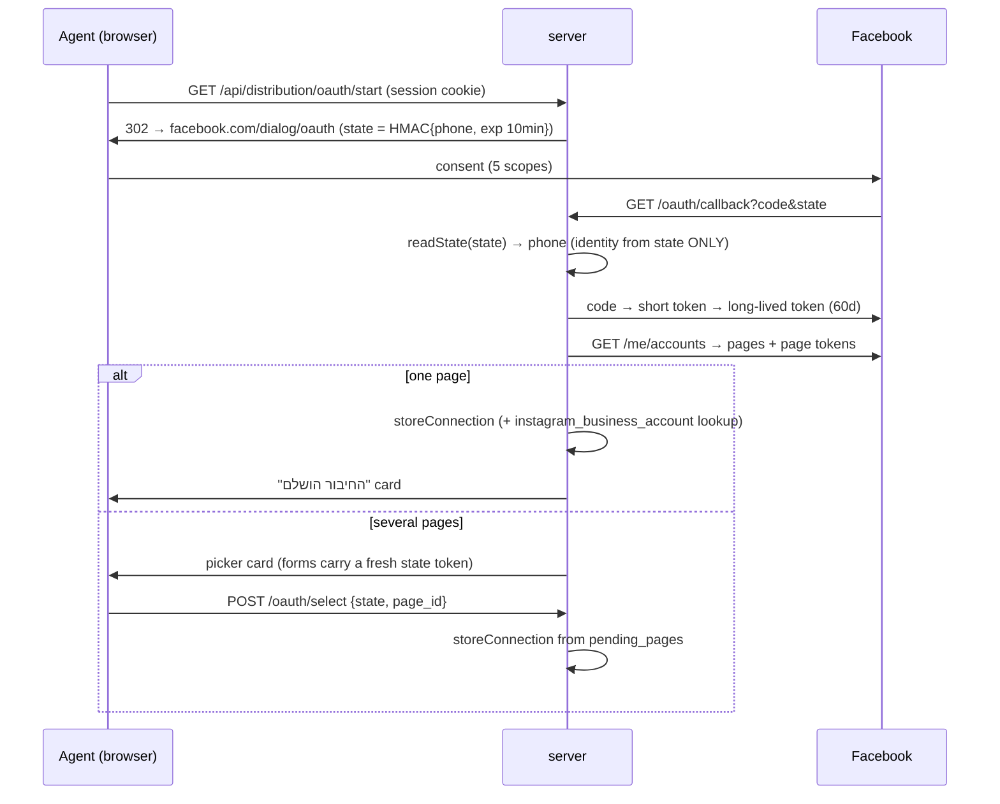
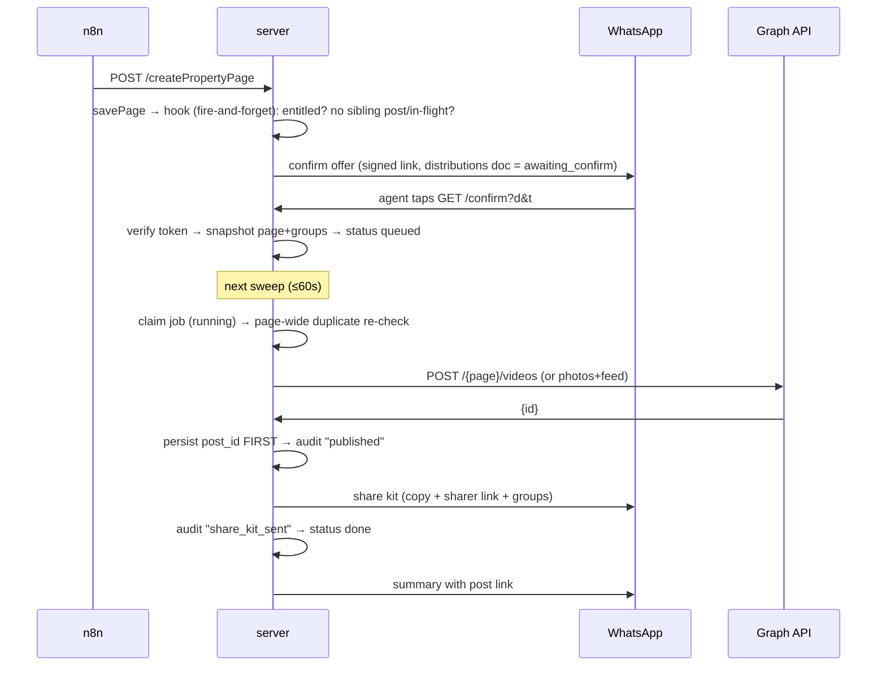
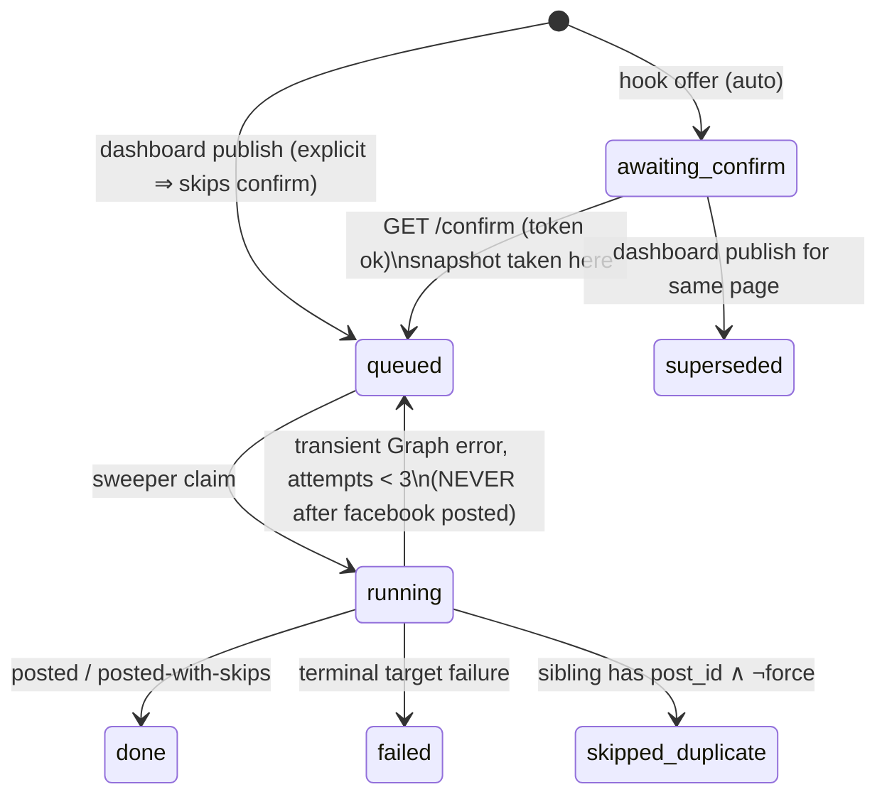

# Content Distribution Implementation Plan

> **For agentic workers:** REQUIRED SUB-SKILL: Use superpowers:subagent-driven-development (recommended) or superpowers:executing-plans to implement this plan task-by-task. Steps use checkbox (`- [ ]`) syntax for tracking.

**Goal:** One tap on WhatsApp publishes an agent's property page to their Facebook Page (video or multi-photo post with Hebrew copy), hands them a share kit for their Facebook groups, and (days 3–7) posts to Instagram — every action audited in `post_actions`.

**Architecture:** Approach A from the approved spec (`docs/superpowers/specs/2026-08-16-content-distribution-design.md`): pure modules under `server/distribution/`, a Firestore-backed job queue (`distributions` collection) driven by an in-process 60-second sweeper, and one new Express router mounted at `/api/distribution`. Entitlement mirrors the chatbot pattern: `businesses/{phone}.features.distribution` resolved live under a `DISTRIBUTION_ENABLED` env kill-switch.

**Tech Stack:** Node 20+ (CommonJS), Express 4, firebase-admin (Firestore), Green-API WhatsApp via `server/utils.js sendWhatsApp`, Meta Graph API (default v21.0) called with built-in `fetch`. **No new npm dependencies.**

## Global Constraints

- Repo: `forly-backend` only. Branch: `claude/agent-content-distribution-x8mp6t`. Never push to `main`.
- No deploys, no Firestore prod writes, no secret changes without explicit per-action user approval (CLAUDE.md). This plan ends BEFORE any deploy.
- No new npm dependencies — `express` and `firebase-admin` only, plus Node built-ins.
- All user-facing strings are Hebrew, RTL, matching the tone of existing WhatsApp messages in `auth.js` / `routes/pages.js`.
- Tests are plain `assert` scripts run with `node <file>` and chained into `server/package.json`'s `"test"` script — same style as `chatbot-config.test.js`. No test framework.
- Every Firestore helper in `db.js` must have an in-memory fallback so tests run with no credentials.
- Every external HTTP call carries an explicit `AbortSignal.timeout(...)`.
- Vendor (Graph) error text goes ONLY to the job doc and `post_actions.error` — never to a browser response, never into a WhatsApp message.
- All WhatsApp sends are best-effort (`try/catch` or `.catch()`), never able to fail a request or a job.
- HTML rendered by new routes escapes interpolated values by default.
- Graph API version comes from `META_GRAPH_VERSION` env, default `"v21.0"`.
- Env names (exact): `META_APP_ID`, `META_APP_SECRET`, `META_REDIRECT_URL`, `META_GRAPH_VERSION`, `DISTRIBUTION_ENABLED` (absent ⇒ on).
- Commit after every task (small, descriptive messages). Run `cd server && npm test` before every commit.

---

# Part I — Architecture

## 1.1 System context

```
                 ┌─────────────────────────────  VPS (single container) ─────────────────────────────┐
                 │                                                                                    │
 n8n WW1         │  routes/pages.js                 distribution/jobs.js            Green-API         │
 pipeline ──────►│  createPropertyPage ──hook──►  distributions queue  ──sweep──►  WhatsApp ─────────►│──► agent's phone
 (video ready)   │        │                        (Firestore, 60s tick)   │                          │    (confirm link,
                 │        ▼                              │                 │                          │     share kit,
                 │  property_pages doc                   │                 ▼                          │     summaries)
                 │        │                              │        distribution/meta.js ──────────────►│──► Meta Graph API
                 │        ▼                              │        distribution/instagram.js           │    (Page post, IG)
 buyer ─────────►│  GET /p/:id  (+ og.js tags)           ▼                                            │
                 │                              post_actions audit                                    │
 agent ─────────►│  public-agent/distribution.html ──► routes/distribution.js                         │
 (dashboard)     │                                      (OAuth, confirm, publish, groups, status)     │
                 │                                                                                    │
 operator ──────►│  routes/admin.js  (features.distribution toggle)                                   │
                 └────────────────────────────────────────────────────────────────────────────────────┘
                                             │
                                             ▼
                                   Firestore (Admin SDK only)
                 businesses/{phone} · businesses/{phone}/connections/facebook
                 property_pages · distributions · post_actions
```

Nothing new is deployed: the feature is additional modules inside the existing
`server/` Express process, the same one that already builds pages, sends
WhatsApp, and talks to Firestore.

## 1.2 Decision record (why it's built this way)

| Decision | Choice | Rationale / rejected alternative |
|---|---|---|
| Where the code runs | Existing Express server on the VPS (Approach A) | The page docs, GreenAPI creds, auth, and admin panel all live here already. Cloud Functions (Approach B) would split the feature across two deploy surfaces and duplicate auth + WhatsApp plumbing for zero gain at this scale. |
| Queue | `distributions` collection + in-process 60s sweeper | Job state must survive restarts (⇒ Firestore, not an in-memory array), but execution doesn't need Cloud Tasks/PubSub at ~tens of posts/day. 60s latency is invisible next to a WhatsApp confirm step. Known limitation: one container — a second container would double-post; the claim would need a Firestore precondition write. Documented in `jobs.js`. |
| Trigger | Auto-offer on page-ready, gated by one-tap WhatsApp confirm | Fully automatic posting was rejected (agent must control what appears under their name); fully manual was rejected (agents forget). The confirm link is the middle: zero-effort but explicit. |
| Facebook groups | WhatsApp share kit, no automation | Meta removed the Groups publishing API (2022). Browser automation risks the agent's personal account — rejected outright. The kit turns group posting into ~5 taps. |
| Snapshot at enqueue | Post content frozen into `distributions.snapshot` when the agent confirms | What the agent approved is what posts, even if the page is edited while the job waits. Also makes the audit log exact. |
| Tokens | Per-agent Meta tokens in `businesses/{phone}/connections/facebook` | They're per-agent *data*, not deployment config — Secret Manager/env is for app-level secrets (`META_APP_SECRET`). Firestore client access is already denied globally; only the Admin SDK reads them. |
| Kill switch | `DISTRIBUTION_ENABLED` env (absent ⇒ on) | Same reasoning as `CHATBOT_ENABLED`: "stop everything now" must not depend on Firestore being healthy. |
| Entitlement | `features.distribution` resolved live per request | Flipping the admin toggle affects the agent's whole catalogue instantly (60s business-cache, invalidated on admin writes) — never stamped onto pages. |
| Re-publish | Blocked page-wide; explicit `force:true` after a dialog | The #1 nightmare is the same apartment posted twice. Every path re-checks; repost is a deliberate two-step. |
| Marketplace feeds / takedown | Out of scope | Product-owner decisions on record in the spec. `GET /packet` was dropped from the routes. |

## 1.3 Module dependency graph

```
routes/distribution.js ─┬─► distribution/jobs.js ─┬─► distribution/meta.js      (no deps)
routes/pages.js (hook) ─┘                          ├─► distribution/instagram.js ─► meta.js
                                                   ├─► distribution/share-kit.js (no deps)
routes/admin.js (toggle only)                      ├─► distribution/config.js    (no deps)
                                                   ├─► db.js                     (firebase-admin)
og.js (no deps) ◄─ routes/pages.js                 ├─► business-cache.js ─► db.js
                                                   └─► auth.js (signActionToken) · utils.js (sendWhatsApp)
```

Arrows point at dependencies; there are no cycles. Every impure edge into
`jobs.js` goes through the injected `deps` object, which is what makes the
whole state machine testable with fakes (`liveDeps()` is the only place the
real modules are wired together).

## 1.4 Runtime characteristics

- **Throughput ceiling:** sweeper claims ≤10 queued jobs/minute ⇒ ~600
  posts/hour — two orders of magnitude above need. Videos are posted by
  `file_url`, so Facebook pulls the file itself; the server never streams
  video bytes to Meta.
- **Added load on page views:** zero extra Firestore reads — OG tags render
  from the page doc already being fetched; entitlement uses the existing
  60s business cache.
- **Timeouts:** video publish 120s, photos/IG 60s, everything else 30s,
  WhatsApp 20s (existing). All explicit `AbortSignal.timeout`.
- **Blast radius:** the hook is fire-and-forget (page creation can never
  fail because of distribution); the sweeper isolates per job; WhatsApp
  sends are best-effort; the kill switch stops new offers and, because
  entitlement is re-checked at offer time only and execution requires a
  queued doc, drains to silence within one sweep of flipping it.

---

# Part II — Technical deep dive

## 2.1 End-to-end sequences

**Connect (once per agent):**



**Auto publish (per property):**



**Dashboard repost:** `POST /publish` → `409 already_published` → repost
dialog → `POST /publish {force:true}` → supersede stale offers → queued doc
with `force` → sweeper posts → audit `reposted`.

## 2.2 Distribution state machine



Target-level: `facebook_page` `pending→posted|failed|skipped`,
`instagram` likewise (`skipped` when no linked IG account), `share_kit`
`pending→sent|skipped`. The doc's terminal status is `failed` iff any
attempted target failed; skips don't fail the job.

## 2.3 API contract

| Method & path | Auth | Request | Success | Errors |
|---|---|---|---|---|
| `GET /api/distribution/oauth/start` | session | — | 302 to Facebook | 401; 503 `distribution_not_configured` (env missing) |
| `GET /api/distribution/oauth/callback` | HMAC `state` (10-min TTL) | `code`,`state` | HTML success card / page picker | 401 expired-state card; 502 card on Graph failure |
| `POST /api/distribution/oauth/select` | HMAC `state` | form `state`,`page_id` | HTML success card | 401 / 400 cards |
| `GET /api/distribution/confirm` | action token `[id,"confirm"]` | `d`,`t` | HTML: אושר / כבר בתהליך / כבר פורסם | 401/404 invalid-link card |
| `POST /api/distribution/publish` | session + owner | `{page_id, force?}` | `{ok, distribution_id}` | 400/403 `not_owner`/`not_entitled`/404; **409 `already_in_flight`**, **409 `already_published`** |
| `POST /api/distribution/groups` | session | `{groups:[]}` | `{ok, groups, min_recommended:5}` | 401 |
| `GET /api/distribution/status[?page_id]` | session (+owner for page_id) | — | `{entitled, connection{connected,page_name,needs_reconnect,instagram_linked}, groups, listing?{posted,post_url,in_flight,last_status}}` | 401, 404 |
| `POST /api/admin/business/features` (existing) | admin allowlist | `{phone, feature:"distribution", enabled}` | `{ok,…}` | existing semantics |

Never in any response: tokens, snapshots, vendor error text.

## 2.4 Firestore schema (field-by-field)

**`businesses/{phone}/connections/facebook`** — `user_token` (long-lived, ~60d),
`page_id`, `page_name`, `page_token` (non-expiring), `ig_business_id` (nullable),
`pending_pages` (transient array during multi-page pick, cleared on select),
`scopes[]`, `connected_at`, `needs_reconnect` (bool — set on Graph 190/OAuthException,
cleared by `storeConnection` on reconnect).

**`businesses/{phone}`** — adds `features.distribution` (admin-gated bool)
and `distribution.groups` (≤20 sanitized group URLs).

**`distributions/{uuid}`** — `id`, `page_id`, `business_phone`, `status`,
`trigger`, `force`, `targets.{facebook_page,instagram,share_kit}` (per-target
`status/post_id/post_url/media_id/permalink/error/attempts`),
`snapshot{title, page_url, video_url, poster_url, photo_urls[≤10], copy, groups}`,
`created_at`, `updated_at`, `confirmed_at`.

**`post_actions/{auto}`** (append-only) — `business_phone`, `page_id`,
`distribution_id`, `target`, `action`, `at`, `trigger`, `post_id`, `post_url`,
`content{copy, media_type: video|photos|none, media_count, media_urls[]}`,
`error`. Written on success AND failure; this is the reporting surface.

**Indexes:** all queries are single-field `where` (+ in-memory sort/filter) —
no composite indexes, no `firestore.indexes.json` change.

## 2.5 Security & token model

| Surface | Identity | Why |
|---|---|---|
| oauth/start, publish, groups, status | session cookie (`requireAuth`) | agent is in the dashboard |
| oauth/callback, oauth/select | HMAC state token, 10-min TTL | agent may arrive with no cookie (WhatsApp browser); state is minted server-side for a specific phone |
| confirm | HMAC action token bound to the distribution id | one-tap from WhatsApp; replay is harmless (status has moved on → honest card, never a second post) |

Token lifecycle: OAuth `code` → short user token → long-lived user token →
page token (non-expiring when derived from a long-lived token). Death:
Graph 190/OAuthException at publish time ⇒ `needs_reconnect=true`, one
WhatsApp nudge, all FB/IG publishing skipped for that agent until they
reconnect (which overwrites the connection doc and clears the flag).

Hardening baked into the tasks: group URLs whitelisted to
`facebook.com/groups/<slug>` and capped; all card HTML escaped; OG injection
$-safe; app secret only in env; page picker can only choose from
server-stored `pending_pages`; owner checks compare `business_phone` to the
session like `routes/pages.js` does.

## 2.6 Failure-mode matrix

| Failure | Detected by | Job behavior | Agent sees | Recovery |
|---|---|---|---|---|
| Token expired/revoked (190) | `isAuthError` | target `failed`, terminal | one reconnect nudge | reconnect from dashboard |
| Transient Graph error | `GraphError`, other codes | requeued, ≤3 attempts | nothing until resolved | automatic |
| Timeout/network on visible post | non-GraphError | **terminal, never retried** | "ייתכן שהפוסט כן עלה — בדקו בדף" | agent checks page; repost is `force` |
| IG fails after FB posted | any | IG terminal (no requeue — would re-run FB) | "פייסבוק עלה, אינסטגרם נכשל" | retry from dashboard |
| Not connected / no IG | missing connection fields | target `skipped`, job continues | honest "לא חובר" line; share kit still arrives | connect once |
| Duplicate attempt | page-wide sibling check | `skipped_duplicate` | "כבר פורסם" | deliberate repost path |
| Malformed job doc | executor validation | that doc `failed` | — | sweep continues unharmed |
| Sweeper crash mid-job | catch in `runSweep` | doc back to `queued` | — | next sweep |
| WhatsApp down | catch on send | job unaffected | message lost (logged) | — |
| Firestore down | hook/sweep catches | offers/sweeps skip, page creation unaffected | — | self-heals |
| Runaway spend / emergency | operator | — | — | `DISTRIBUTION_ENABLED=false` + restart |

## 2.7 Rollout plan

1. **Dark ship (end of Day 2):** deploy with zero entitled agents — the only
   behavioral change anyone can observe is OG tags on `/p/:id` (pure win).
2. **Pilot:** flip `features.distribution` for 1–3 chosen agents who are
   Testers on the Meta app (Dev Mode). Watch `post_actions`.
3. **Widen:** after App Review approval + Live Mode, flip agents freely —
   no code change involved; the toggle is the rollout.
4. **Rollback at any point:** flip the agent off (per-agent) or set
   `DISTRIBUTION_ENABLED=false` (global). No schema rollback needed —
   the collections are additive.

---

# Part III — Manual tasks: the product owner's checklist

Things only you can do — accounts, secrets, approvals. Each has a "when" so
nothing blocks the build. (Full context for the Meta items:
`docs/distribution/META-APP-SETUP.md`, written on Day 6, and the
walkthrough I gave you in chat.)

## Now, before/while Day 1 runs (longest lead times)

- [ ] **Create the Meta Business Portfolio** (business.facebook.com) for
  Forly/Call4li and **start Business Verification** (company registration
  docs, domain/phone). Days-to-weeks in Israel; App Review is blocked
  without it. Nothing else waits on it, so just start it.
- [ ] **Create the Meta app** at developers.facebook.com: Business use case,
  name **"Forly Publisher"**, attach to the portfolio.
- [ ] **Add the Facebook Login for Business product** and set the redirect
  URI to `https://<prod-host>/api/distribution/oauth/callback` (confirm the
  exact host with me — it must equal `META_REDIRECT_URL` character for
  character).
- [ ] **Pick 1–3 pilot agents** (plus your own account) and decide which
  Facebook Page each will post to.

## Before the MVP can be exercised (end of Day 2)

- [ ] **Put the app credentials on the VPS:** add `META_APP_ID`,
  `META_APP_SECRET`, `META_REDIRECT_URL` to `server/.env` and restart the
  process. Never paste the secret into chat, the repo, or a ticket. (I'll
  tell you the exact moment this is needed; the code no-ops gracefully
  until then.)
- [ ] **Add app roles:** App Roles → Testers → yourself + the pilot agents;
  they must accept the invite at developers.facebook.com. Dev Mode posting
  only works for role-holders.
- [ ] **Two-minute Graph sanity check** (proves the whole chain before any
  code runs): Graph API Explorer → select Forly Publisher → grant the five
  permissions → `GET /me/accounts` → copy a page token →
  `POST /{page-id}/feed` with `message=test`. If that post appears, the
  server flow will work.
- [ ] **Approve the deploy** when I tell you the MVP is green (per
  CLAUDE.md every deploy needs your explicit per-action "yes" — I will
  show you the exact command and wait).
- [ ] **Flip the pilot toggle:** admin panel → the agent →
  `distribution` on (or I run it and you approve, since it's a prod
  Firestore write).

## During Days 3–5

- [ ] **Run the pilot e2e with me** (checklist §7 of META-APP-SETUP.md):
  create a real listing, tap the confirm, see the post, check the share kit.
- [ ] **For Instagram (Day 5):** on the pilot Page, link its **Instagram
  Business account** (Page settings → Linked accounts). Personal IG
  accounts won't work — convert to Business/Creator first.
- [ ] **Website pages for Meta compliance:** App Review requires a public
  **Privacy Policy URL** and a **Data Deletion instructions URL**. These
  belong on the Ruflo site (`forli-creator-website`) — say the word and I'll
  draft both pages as a separate small task; then paste their URLs into
  App settings → Basic.

## Day 6–7 and after

- [ ] **Record the App Review screencast** (I'll drive, you record, or
  vice versa): dashboard → connect → consent screen → one-tap confirm →
  the post appearing on the Page. One continuous take, real UI.
- [ ] **Submit App Review** for Advanced Access on the five permissions,
  with the use-case text from META-APP-SETUP.md §5. Turnaround days-to-2-weeks.
- [ ] **On approval: switch the app to Live Mode** — from that moment any
  agent (not just Testers) can connect, and rollout is purely the admin toggle.
- [ ] **Standing decisions that stay yours:** every deploy, every prod
  Firestore script, flipping any non-pilot agent on, and scheduling the
  marketplace-feeds investigation (yad2/madlan/keyz) as its own project.

---

# Part IV — Implementation tasks (day by day)

## File Structure (what exists at the end)

```
server/
  distribution/
    config.js            entitlement resolver (Task 1)
    config.test.js
    share-kit.js         Hebrew copy + group sanitizer + share-kit message (Task 2)
    share-kit.test.js
    meta.js              Graph adapter + OAuth state tokens (Task 3)
    meta.test.js
    jobs.js              job state machine + sweeper + page-ready hook (Task 6)
    jobs.test.js
    instagram.js         IG publish target (Task 10)
    instagram.test.js
  og.js                  OG-tag builder (Task 5)
  og.test.js
  db.js                  + connections / distributions / post_actions (Task 4)
  routes/distribution.js OAuth, confirm, publish, groups, status (Task 7)
  routes/pages.js        + OG injection (Task 5) + page-ready hook (Task 8)
  routes/admin.js        + "distribution" feature toggle (Task 8)
  index.js               + router mount + sweeper start (Task 7)
  .env.example           + META_* / DISTRIBUTION_ENABLED (Task 8)
public-agent/
  distribution.html      RTL dashboard page (Task 9)
  distribution.js
docs/distribution/
  META-APP-SETUP.md      Meta app checklist + manual e2e (Tasks 11, 13)
```

Statuses used everywhere (exact strings):
- distribution doc: `awaiting_confirm | queued | running | done | failed | skipped_duplicate | superseded`
- `targets.facebook_page.status`: `pending | posted | failed | skipped`
- `targets.share_kit.status`: `pending | sent | skipped`
- `targets.instagram.status` (Task 10): `pending | posted | failed | skipped`
- `post_actions.action`: `published | reposted | share_kit_sent | publish_failed`
- `post_actions.trigger` / distribution `trigger`: `confirm_link | dashboard | auto`

---

### Task 1: Entitlement resolver — `server/distribution/config.js` (Day 1)

**Files:**
- Create: `server/distribution/config.js`
- Create: `server/distribution/config.test.js`
- Modify: `server/package.json` (test chain)

**Interfaces:**
- Consumes: nothing (pure).
- Produces: `globallyEnabled(env) → boolean`; `resolve(business, env) → { enabled: boolean, reason: "global_off"|"agent_on"|"agent_off" }`. Consumed by Tasks 6, 7, 8.

- [ ] **Step 1: Write the failing test**

Create `server/distribution/config.test.js`:

```js
/*
 * Unit tests for distribution/config.js — entitlement precedence.
 * Run: node server/distribution/config.test.js
 */
const assert = require("assert");
const { globallyEnabled, resolve } = require("./config");

// ── global kill switch: absent ⇒ on, only the literal "false" turns it off ──
assert.equal(globallyEnabled({}), true, "absent ⇒ on, no env required");
assert.equal(globallyEnabled({ DISTRIBUTION_ENABLED: "true" }), true);
assert.equal(globallyEnabled({ DISTRIBUTION_ENABLED: "false" }), false);
assert.equal(globallyEnabled({ DISTRIBUTION_ENABLED: " FALSE " }), false);

// ── per-agent flag, resolved live from the business doc ──
const ON = { features: { distribution: true } };
const OFF = { features: { distribution: false } };
assert.deepEqual(resolve(ON, {}), { enabled: true, reason: "agent_on" });
assert.deepEqual(resolve(OFF, {}), { enabled: false, reason: "agent_off" });
assert.deepEqual(resolve({}, {}), { enabled: false, reason: "agent_off" });
assert.equal(resolve(null, {}).enabled, false, "no business ⇒ off, not a crash");

// ── the kill switch outranks the agent flag ──
const off = { DISTRIBUTION_ENABLED: "false" };
assert.deepEqual(resolve(ON, off), { enabled: false, reason: "global_off" });

console.log("config.test.js OK");
```

- [ ] **Step 2: Run test to verify it fails**

Run: `cd server && node distribution/config.test.js`
Expected: FAIL with `Cannot find module './config'`

- [ ] **Step 3: Write the implementation**

Create `server/distribution/config.js`:

```js
/*
 * distribution/config.js — is content distribution on for this agent?
 *
 * Mirrors chatbot-config.js: a per-agent entitlement
 * (businesses/{phone}.features.distribution, resolved live so flipping it
 * covers the agent's whole catalogue) under an env kill-switch. No per-page
 * override — distribution is per-agent by design (spec §2 "Rollout").
 *
 * Pure functions — no I/O. Unit-tested in config.test.js.
 */

// The global kill switch stays in the environment, not the database: it
// answers "stop all posting right now" even when Firestore is the problem.
// Absent ⇒ on, so no env var is required.
function globallyEnabled(env) {
  return String((env || {}).DISTRIBUTION_ENABLED || "").trim().toLowerCase() !== "false";
}

function resolve(business, env) {
  if (!globallyEnabled(env)) return { enabled: false, reason: "global_off" };
  const on = !!(business && business.features && business.features.distribution);
  return { enabled: on, reason: on ? "agent_on" : "agent_off" };
}

module.exports = { globallyEnabled, resolve };
```

- [ ] **Step 4: Run test to verify it passes**

Run: `cd server && node distribution/config.test.js`
Expected: `config.test.js OK`

- [ ] **Step 5: Add to the test chain and commit**

In `server/package.json`, the `"test"` script currently ends with `&& node leads.test.js`. Append `&& node distribution/config.test.js` so it reads:

```
"test": "node overlay.test.js && node pages-auth.test.js && node chatbot-readiness.test.js && node chatbot-config.test.js && node chat-prompt.test.js && node chat-provider.test.js && node leads.test.js && node distribution/config.test.js",
```

```bash
cd server && npm test
git add server/distribution/config.js server/distribution/config.test.js server/package.json
git commit -m "feat(distribution): entitlement resolver under DISTRIBUTION_ENABLED kill-switch"
```

---

### Task 2: Share kit — `server/distribution/share-kit.js` (Day 1)

**Files:**
- Create: `server/distribution/share-kit.js`
- Create: `server/distribution/share-kit.test.js`
- Modify: `server/package.json` (test chain)

**Interfaces:**
- Consumes: a `property_pages` doc shape (see `routes/pages.js:165-229`): `page.property.{title,neighborhood,city,rooms,size_sqm,floor,price,listing_type}`, `page.agent.{name,phone}`.
- Produces (all pure, consumed by Tasks 6, 7, 9):
  - `MAX_GROUPS = 20`
  - `buildPostCopy(page, pageUrl) → string` (the Facebook/IG post text)
  - `sanitizeGroups(urls) → string[]` (valid, deduped, normalized `https://www.facebook.com/groups/<slug>` URLs, capped at `MAX_GROUPS`)
  - `sharerLink(pageUrl) → string`
  - `buildShareKitMessage({ copy, pageUrl, groups }) → string` (the WhatsApp message)

- [ ] **Step 1: Write the failing test**

Create `server/distribution/share-kit.test.js`:

```js
/*
 * Unit tests for distribution/share-kit.js — copy builders + group sanitizer.
 * Run: node server/distribution/share-kit.test.js
 */
const assert = require("assert");
const { MAX_GROUPS, buildPostCopy, sanitizeGroups, sharerLink, buildShareKitMessage } = require("./share-kit");

const page = {
  property: { title: "4 חד׳ בבבלי", neighborhood: "בבלי", city: "תל אביב",
    rooms: 4, size_sqm: 105, floor: 3, price: 4200000, listing_type: "sale" },
  agent: { name: "דנה לוי", phone: "972501234567" },
};
const url = "https://forly.example/p/dana-abc12";

// ── post copy carries the facts, the link, and the agent ──
const copy = buildPostCopy(page, url);
assert.ok(copy.includes("4 חד׳ בבבלי"), "title present");
assert.ok(copy.includes("בבלי, תל אביב"), "location present");
assert.ok(copy.includes("4 חדרים"), "rooms present");
assert.ok(copy.includes("105"), "sqm present");
assert.ok(copy.includes("קומה 3"), "floor present");
assert.ok(copy.includes("₪4,200,000"), "price formatted with separators");
assert.ok(copy.includes(url), "page link present");
assert.ok(copy.includes("דנה לוי"), "agent name present");
assert.ok(copy.includes("0501234567"), "phone shown in local 05x form");

// ── missing fields drop their lines instead of printing zeros ──
const bare = buildPostCopy({ property: { title: "נכס" }, agent: {} }, url);
assert.ok(!bare.includes("קומה"), "no floor line when floor is 0/absent");
assert.ok(!bare.includes("₪"), "no price line when price is 0/absent");
assert.ok(bare.includes(url));

// ── group sanitizer: facebook.com/groups/* only, normalized, deduped, capped ──
assert.deepEqual(sanitizeGroups([
  "https://www.facebook.com/groups/tlvrealestate",
  "https://facebook.com/groups/tlvrealestate/",          // dupe after normalize
  "https://m.facebook.com/groups/dira.bemerkaz",
  "https://www.facebook.com/dana.levy",                  // not a group → dropped
  "https://evil.example/groups/x",                       // wrong host → dropped
  "not a url",
]), [
  "https://www.facebook.com/groups/tlvrealestate",
  "https://www.facebook.com/groups/dira.bemerkaz",
]);
assert.equal(sanitizeGroups(null).length, 0, "non-array ⇒ empty, not a crash");
const many = Array.from({ length: 30 }, (_, i) => `https://www.facebook.com/groups/g${i}`);
assert.equal(sanitizeGroups(many).length, MAX_GROUPS, "capped at MAX_GROUPS");

// ── sharer link URL-encodes the page URL ──
assert.equal(sharerLink("https://x.test/p/a?b=1"),
  "https://www.facebook.com/sharer/sharer.php?u=" + encodeURIComponent("https://x.test/p/a?b=1"));

// ── share-kit message: copy between markers, sharer link, numbered groups ──
const kit = buildShareKitMessage({ copy: "COPYBLOCK", pageUrl: url,
  groups: ["https://www.facebook.com/groups/a", "https://www.facebook.com/groups/b"] });
assert.ok(kit.includes("COPYBLOCK"));
const marker = kit.split("\n").find((l) => /^─+$/.test(l));
assert.ok(marker, "copy is fenced between ── marker lines");
assert.equal(kit.split("\n").filter((l) => l === marker).length, 2, "two marker lines");
assert.ok(kit.includes(sharerLink(url)));
assert.ok(kit.includes("1. https://www.facebook.com/groups/a"));
assert.ok(kit.includes("2. https://www.facebook.com/groups/b"));

// ── no groups saved yet: honest nudge instead of an empty list ──
const empty = buildShareKitMessage({ copy: "C", pageUrl: url, groups: [] });
assert.ok(!empty.includes("1. "), "no numbered lines");
assert.ok(empty.includes("לא הוגדרו"), "tells the agent no groups are saved yet");

console.log("share-kit.test.js OK");
```

- [ ] **Step 2: Run test to verify it fails**

Run: `cd server && node distribution/share-kit.test.js`
Expected: FAIL with `Cannot find module './share-kit'`

- [ ] **Step 3: Write the implementation**

Create `server/distribution/share-kit.js`:

```js
/*
 * distribution/share-kit.js — pure Hebrew copy builders for distribution.
 *
 * Groups get a WhatsApp "share kit" instead of automated posting: Meta removed
 * the Groups publishing API in 2022 and browser automation was rejected as a
 * ban risk (spec §1). So this module builds (a) the post copy used for the
 * Facebook Page / Instagram post, and (b) a WhatsApp message that lets the
 * agent paste that copy into their groups in ~5 taps.
 *
 * Pure functions — no I/O. Unit-tested in share-kit.test.js.
 */

const MAX_GROUPS = 20;

// 972501234567 → 0501234567 for display; anything non-IL stays as-is.
function localPhone(p) {
  const s = String(p || "");
  return /^9725\d{8}$/.test(s) ? "0" + s.slice(3) : s;
}

function buildPostCopy(page, pageUrl) {
  const p = (page && page.property) || {};
  const a = (page && page.agent) || {};
  const lines = [];
  lines.push(`🏠 ${p.title || "נכס חדש"}`);
  const loc = [p.neighborhood, p.city].filter(Boolean).join(", ");
  if (loc) lines.push(`📍 ${loc}`);
  const facts = [];
  if (Number(p.rooms) > 0) facts.push(`${p.rooms} חדרים`);
  if (Number(p.size_sqm) > 0) facts.push(`${p.size_sqm} מ"ר`);
  if (Number(p.floor) > 0) facts.push(`קומה ${p.floor}`);
  if (facts.length) lines.push(facts.join(" · "));
  if (Number(p.price) > 0) {
    const verb = p.listing_type === "rent" ? "שכירות" : "מחיר";
    lines.push(`💰 ${verb}: ₪${Number(p.price).toLocaleString("en-US")}`);
  }
  lines.push("");
  lines.push(`לכל הפרטים, תמונות וסרטון ⬅️ ${pageUrl}`);
  if (a.name) {
    const phone = localPhone(a.phone);
    lines.push(`${a.name}${phone ? ` · ${phone}` : ""}`);
  }
  return lines.join("\n");
}

// facebook.com/groups/<slug> on facebook.com / www / m / web hosts only.
// Normalized to one canonical form so duplicates collapse; capped so a
// pathological dashboard payload can't turn the share kit into a novel.
function sanitizeGroups(urls) {
  const out = [];
  for (const raw of Array.isArray(urls) ? urls : []) {
    let u;
    try { u = new URL(String(raw).trim()); } catch { continue; }
    if (u.protocol !== "https:" && u.protocol !== "http:") continue;
    if (!/^(www\.|m\.|web\.)?facebook\.com$/i.test(u.hostname)) continue;
    const m = u.pathname.match(/^\/groups\/([A-Za-z0-9._-]+)\/?$/);
    if (!m) continue;
    const clean = `https://www.facebook.com/groups/${m[1]}`;
    if (!out.includes(clean)) out.push(clean);
    if (out.length >= MAX_GROUPS) break;
  }
  return out;
}

function sharerLink(pageUrl) {
  return `https://www.facebook.com/sharer/sharer.php?u=${encodeURIComponent(String(pageUrl || ""))}`;
}

const FENCE = "──────────";

function buildShareKitMessage({ copy, pageUrl, groups }) {
  const parts = [
    "📣 ערכת שיתוף לקבוצות פייסבוק",
    "",
    "העתיקו את הטקסט שבין הקווים והדביקו בקבוצות שלכם:",
    FENCE,
    String(copy || ""),
    FENCE,
    "",
    `שיתוף מהיר בפייסבוק: ${sharerLink(pageUrl)}`,
  ];
  const gs = Array.isArray(groups) ? groups : [];
  if (gs.length) {
    parts.push("", "הקבוצות שלכם (הקישו, הדביקו, פרסמו):");
    gs.forEach((g, i) => parts.push(`${i + 1}. ${g}`));
  } else {
    parts.push("", "עדיין לא הוגדרו קבוצות — אפשר להוסיף אותן בעמוד ההפצה בדשבורד.");
  }
  return parts.join("\n");
}

module.exports = { MAX_GROUPS, buildPostCopy, sanitizeGroups, sharerLink, buildShareKitMessage };
```

- [ ] **Step 4: Run test to verify it passes**

Run: `cd server && node distribution/share-kit.test.js`
Expected: `share-kit.test.js OK`

- [ ] **Step 5: Add to the test chain and commit**

Append `&& node distribution/share-kit.test.js` to the `"test"` script in `server/package.json`.

```bash
cd server && npm test
git add server/distribution/share-kit.js server/distribution/share-kit.test.js server/package.json
git commit -m "feat(distribution): Hebrew post copy, group sanitizer and WhatsApp share kit"
```

---

### Task 3: Graph adapter + OAuth state tokens — `server/distribution/meta.js` (Day 1)

**Files:**
- Create: `server/distribution/meta.js`
- Create: `server/distribution/meta.test.js`
- Modify: `server/package.json` (test chain)

**Interfaces:**
- Consumes: nothing from this codebase (Node built-ins only: `crypto`, `fetch`, `URL`, `URLSearchParams`).
- Produces (consumed by Tasks 6, 7, 10):
  - `class GraphError extends Error` with `{ status, code, subcode, type, fbtraceId }`
  - `isAuthError(err) → boolean` (true for `code === 190` or `type === "OAuthException"`)
  - `SCOPES` — `["pages_show_list","pages_read_engagement","pages_manage_posts","instagram_basic","instagram_content_publish"]` (IG scopes requested from day one so day-5 needs no reconnect)
  - `oauthStartUrl({ appId, redirectUrl, state, graphVersion }) → string`
  - `makeState(payload, secret, nowMs?) → string` / `readState(token, secret, nowMs?) → payload|null` (HMAC-signed, 10-min TTL)
  - `graphCall(pathname, { method, params, token, graphVersion, timeoutMs, fetchFn }) → Promise<json>` (form-encoded, throws `GraphError`)
  - `exchangeCode({ code, appId, appSecret, redirectUrl, graphVersion, fetchFn })` → `{ access_token }`
  - `longLivedToken({ token, appId, appSecret, graphVersion, fetchFn })` → `{ access_token }`
  - `listPages({ userToken, graphVersion, fetchFn })` → `[{ id, name, access_token }]`
  - `publishVideo({ pageId, pageToken, fileUrl, description, graphVersion, fetchFn })` → `{ id }`
  - `publishPhotos({ pageId, pageToken, photoUrls, message, graphVersion, fetchFn })` → `{ id }` (unpublished photos + `attached_media` feed post)
  - `postUrl(postId) → string`

All network functions take `fetchFn` (default global `fetch`) so tests inject fakes; `makeState`/`readState` take `nowMs` for TTL tests.

- [ ] **Step 1: Write the failing test**

Create `server/distribution/meta.test.js`:

```js
/*
 * Unit tests for distribution/meta.js — builders, state tokens, error
 * classification, publish flows against an injected fake fetch.
 * Run: node server/distribution/meta.test.js
 */
const assert = require("assert");
const meta = require("./meta");

(async () => {
  // ── oauth start URL carries app id, redirect, state and the scopes ──
  const u = new URL(meta.oauthStartUrl({
    appId: "123", redirectUrl: "https://x.test/cb", state: "S1", graphVersion: "v21.0" }));
  assert.equal(u.origin + u.pathname, "https://www.facebook.com/v21.0/dialog/oauth");
  assert.equal(u.searchParams.get("client_id"), "123");
  assert.equal(u.searchParams.get("redirect_uri"), "https://x.test/cb");
  assert.equal(u.searchParams.get("state"), "S1");
  assert.equal(u.searchParams.get("scope"), meta.SCOPES.join(","));

  // ── state tokens: round-trip, tamper-proof, 10-minute TTL ──
  const t0 = 1_000_000_000_000;
  const tok = meta.makeState({ phone: "972501234567" }, "sec", t0);
  assert.equal(meta.readState(tok, "sec", t0 + 9 * 60 * 1000).phone, "972501234567");
  assert.equal(meta.readState(tok, "sec", t0 + 11 * 60 * 1000), null, "expired after 10 min");
  assert.equal(meta.readState(tok, "other", t0), null, "wrong secret");
  assert.equal(meta.readState(tok.slice(0, -2) + "xx", "sec", t0), null, "tampered sig");
  assert.equal(meta.readState("garbage", "sec", t0), null);

  // ── graphCall: form-encoded POST, token appended, JSON out ──
  const calls = [];
  const okFetch = (body) => async (url, opts) => {
    calls.push({ url: String(url), opts });
    return { ok: true, json: async () => body };
  };
  const r = await meta.graphCall("/me", { method: "POST", params: { a: "1" },
    token: "TOK", graphVersion: "v21.0", fetchFn: okFetch({ id: "9" }) });
  assert.equal(r.id, "9");
  assert.equal(calls[0].url, "https://graph.facebook.com/v21.0/me");
  assert.equal(calls[0].opts.headers["content-type"], "application/x-www-form-urlencoded");
  assert.ok(calls[0].opts.body.includes("access_token=TOK"));
  assert.ok(calls[0].opts.signal instanceof AbortSignal, "explicit timeout signal");

  // ── Graph errors become GraphError with code/subcode/type surfaced ──
  const errFetch = async () => ({ ok: false, status: 400, json: async () => ({
    error: { message: "bad token", type: "OAuthException", code: 190, error_subcode: 463 } }) });
  await assert.rejects(
    () => meta.graphCall("/me", { fetchFn: errFetch }),
    (e) => e instanceof meta.GraphError && e.code === 190 && e.subcode === 463
      && e.type === "OAuthException" && meta.isAuthError(e));
  assert.equal(meta.isAuthError(new Error("network down")), false);
  assert.equal(meta.isAuthError(new meta.GraphError("x", { code: 1 })), false);

  // ── publishVideo posts file_url + description to /{page}/videos ──
  const vcalls = [];
  const vFetch = async (url, opts) => { vcalls.push({ url: String(url), opts });
    return { ok: true, json: async () => ({ id: "VID1" }) }; };
  const v = await meta.publishVideo({ pageId: "P1", pageToken: "PT",
    fileUrl: "https://x.test/v.mp4", description: "תיאור", graphVersion: "v21.0", fetchFn: vFetch });
  assert.equal(v.id, "VID1");
  assert.equal(vcalls[0].url, "https://graph.facebook.com/v21.0/P1/videos");
  const vBody = new URLSearchParams(vcalls[0].opts.body);
  assert.equal(vBody.get("file_url"), "https://x.test/v.mp4");
  assert.equal(vBody.get("description"), "תיאור");
  assert.equal(vBody.get("access_token"), "PT");

  // ── publishPhotos: N unpublished photo uploads, then one feed post ──
  const pcalls = [];
  const pFetch = async (url, opts) => {
    pcalls.push({ url: String(url), body: new URLSearchParams(opts.body) });
    const isPhoto = String(url).endsWith("/photos");
    return { ok: true, json: async () => (isPhoto ? { id: `PH${pcalls.length}` } : { id: "FEED1" }) };
  };
  const p = await meta.publishPhotos({ pageId: "P1", pageToken: "PT",
    photoUrls: ["https://x.test/1.jpg", "https://x.test/2.jpg"],
    message: "טקסט", graphVersion: "v21.0", fetchFn: pFetch });
  assert.equal(p.id, "FEED1");
  assert.equal(pcalls.length, 3, "2 photo uploads + 1 feed post");
  assert.equal(pcalls[0].body.get("published"), "false");
  assert.equal(pcalls[0].body.get("url"), "https://x.test/1.jpg");
  const feed = pcalls[2];
  assert.ok(feed.url.endsWith("/P1/feed"));
  assert.equal(feed.body.get("message"), "טקסט");
  assert.deepEqual(JSON.parse(feed.body.get("attached_media")),
    [{ media_fbid: "PH1" }, { media_fbid: "PH2" }]);

  assert.equal(meta.postUrl("123_456"), "https://www.facebook.com/123_456");
  console.log("meta.test.js OK");
})().catch((e) => { console.error(e); process.exit(1); });
```

- [ ] **Step 2: Run test to verify it fails**

Run: `cd server && node distribution/meta.test.js`
Expected: FAIL with `Cannot find module './meta'`

- [ ] **Step 3: Write the implementation**

Create `server/distribution/meta.js`:

```js
/*
 * distribution/meta.js — Meta Graph API adapter.
 *
 * Pure request builders + one thin form-encoded transport (graphCall) so the
 * flows are testable with an injected fetch. Errors surface as GraphError with
 * Meta's code/subcode/type intact — jobs.js classifies on those (190 /
 * OAuthException ⇒ the agent must reconnect; other Graph codes ⇒ transient,
 * retryable; non-Graph failures on a visible post ⇒ terminal, spec §7).
 *
 * OAuth state tokens live here too: the callback's identity comes ONLY from
 * the HMAC-signed state (10-min TTL) — never from a cookie or query param.
 */

const crypto = require("crypto");

const DEFAULT_VERSION = "v21.0";
const STATE_TTL_MS = 10 * 60 * 1000;

// IG scopes requested from day one: adding them later would force every
// already-connected agent through a reconnect when Instagram ships (day 5).
const SCOPES = [
  "pages_show_list", "pages_read_engagement", "pages_manage_posts",
  "instagram_basic", "instagram_content_publish",
];

class GraphError extends Error {
  constructor(message, { status, code, subcode, type, fbtraceId } = {}) {
    super(message);
    this.name = "GraphError";
    this.status = status; this.code = code; this.subcode = subcode;
    this.type = type; this.fbtraceId = fbtraceId;
  }
}

const isAuthError = (err) =>
  err instanceof GraphError && (err.code === 190 || err.type === "OAuthException");

// ── OAuth state (HMAC, TTL — the callback's only source of identity) ──
const stateSig = (body, secret) =>
  crypto.createHmac("sha256", secret).update(`fbstate:${body}`).digest("base64url");

function makeState(payload, secret, nowMs = Date.now()) {
  const body = Buffer.from(JSON.stringify({ ...payload, exp: nowMs + STATE_TTL_MS }))
    .toString("base64url");
  return `${body}.${stateSig(body, secret)}`;
}

function readState(token, secret, nowMs = Date.now()) {
  if (typeof token !== "string" || !token.includes(".")) return null;
  const [body, sig] = token.split(".");
  const a = Buffer.from(sig || ""), b = Buffer.from(stateSig(body, secret));
  if (a.length !== b.length || !crypto.timingSafeEqual(a, b)) return null;
  try {
    const payload = JSON.parse(Buffer.from(body, "base64url").toString("utf8"));
    if (!payload.exp || payload.exp < nowMs) return null;
    return payload;
  } catch { return null; }
}

function oauthStartUrl({ appId, redirectUrl, state, graphVersion = DEFAULT_VERSION }) {
  const q = new URLSearchParams({
    client_id: appId, redirect_uri: redirectUrl, state,
    scope: SCOPES.join(","), response_type: "code",
  });
  return `https://www.facebook.com/${graphVersion}/dialog/oauth?${q}`;
}

// ── transport ──
async function graphCall(pathname, { method = "GET", params = {}, token,
  graphVersion = DEFAULT_VERSION, timeoutMs = 30000, fetchFn = fetch } = {}) {
  const url = new URL(`https://graph.facebook.com/${graphVersion}${pathname}`);
  const form = new URLSearchParams();
  for (const [k, v] of Object.entries(params)) {
    if (v !== undefined && v !== null) form.set(k, String(v));
  }
  if (token) form.set("access_token", token);

  let resp;
  if (method === "GET") {
    url.search = form.toString();
    resp = await fetchFn(url, { signal: AbortSignal.timeout(timeoutMs) });
  } else {
    resp = await fetchFn(url, {
      method,
      headers: { "content-type": "application/x-www-form-urlencoded" },
      body: form.toString(),
      signal: AbortSignal.timeout(timeoutMs),
    });
  }
  let json = null;
  try { json = await resp.json(); } catch { /* non-JSON body handled below */ }
  if (!resp.ok || (json && json.error)) {
    const e = (json && json.error) || {};
    throw new GraphError(e.message || `graph ${resp.status}`, {
      status: resp.status, code: e.code, subcode: e.error_subcode,
      type: e.type, fbtraceId: e.fbtrace_id,
    });
  }
  return json || {};
}

// ── flows ──
const exchangeCode = ({ code, appId, appSecret, redirectUrl, graphVersion, fetchFn }) =>
  graphCall("/oauth/access_token", { graphVersion, fetchFn, params: {
    client_id: appId, client_secret: appSecret, redirect_uri: redirectUrl, code } });

const longLivedToken = ({ token, appId, appSecret, graphVersion, fetchFn }) =>
  graphCall("/oauth/access_token", { graphVersion, fetchFn, params: {
    grant_type: "fb_exchange_token", client_id: appId,
    client_secret: appSecret, fb_exchange_token: token } });

const listPages = async ({ userToken, graphVersion, fetchFn }) => {
  const r = await graphCall("/me/accounts", { graphVersion, fetchFn, token: userToken,
    params: { fields: "id,name,access_token", limit: 50 } });
  return r.data || [];
};

// A video upload takes as long as Facebook takes to pull the file — give it
// longer than the default before the timeout-is-terminal rule kicks in.
const publishVideo = ({ pageId, pageToken, fileUrl, description, graphVersion, fetchFn }) =>
  graphCall(`/${pageId}/videos`, { method: "POST", graphVersion, fetchFn,
    token: pageToken, timeoutMs: 120000,
    params: { file_url: fileUrl, description } });

async function publishPhotos({ pageId, pageToken, photoUrls, message, graphVersion, fetchFn }) {
  const ids = [];
  for (const url of photoUrls) {
    const r = await graphCall(`/${pageId}/photos`, { method: "POST", graphVersion,
      fetchFn, token: pageToken, timeoutMs: 60000, params: { url, published: "false" } });
    ids.push(r.id);
  }
  return graphCall(`/${pageId}/feed`, { method: "POST", graphVersion, fetchFn,
    token: pageToken, timeoutMs: 60000, params: {
      message, attached_media: JSON.stringify(ids.map((id) => ({ media_fbid: id }))) } });
}

// Facebook redirects /{id} to the canonical post/video URL — good enough for
// the WhatsApp summary link without another Graph read.
const postUrl = (postId) => `https://www.facebook.com/${postId}`;

module.exports = {
  DEFAULT_VERSION, SCOPES, GraphError, isAuthError,
  makeState, readState, oauthStartUrl, graphCall,
  exchangeCode, longLivedToken, listPages, publishVideo, publishPhotos, postUrl,
};
```

- [ ] **Step 4: Run test to verify it passes**

Run: `cd server && node distribution/meta.test.js`
Expected: `meta.test.js OK`

- [ ] **Step 5: Add to the test chain and commit**

Append `&& node distribution/meta.test.js` to the `"test"` script.

```bash
cd server && npm test
git add server/distribution/meta.js server/distribution/meta.test.js server/package.json
git commit -m "feat(distribution): Graph API adapter with typed errors and signed OAuth state"
```

---

### Task 4: Storage — `server/db.js` additions (Day 1)

**Files:**
- Modify: `server/db.js` (add after the `businesses` section, before `leads`; extend `mem` and `module.exports`)

**Interfaces:**
- Consumes: existing `db`/`mem`/`FieldValue` internals of `db.js`.
- Produces (consumed by Tasks 6, 7, 9, 10):
  - `getConnection(phone) → object|null` — `businesses/{phone}/connections/facebook`
  - `setConnection(phone, patch)` — merge write; mem fallback deep-merges plain objects (Firestore `merge:true` parity)
  - `saveDistribution(doc)` / `getDistribution(id) → doc|null`
  - `updateDistribution(id, dotPatch)` — `{ "a.b": v }` dot-path patch, same semantics as `updatePage`
  - `listDistributionsByPage(pageId, limit=50) → doc[]`
  - `listQueuedDistributions(limit=10) → doc[]` (status `"queued"`)
  - `addPostAction(doc)` — append-only, stamps `at: new Date()` when absent
- Tested through `jobs.test.js` (Task 6) via the mem fallback; no separate test file (matches how the rest of `db.js` is covered).

- [ ] **Step 1: Extend the mem store**

In `server/db.js`, change the `mem` line to add three stores:

```js
const mem = { listings: new Map(), pages: new Map(), leads: new Map(), leadSubmissions: [], throttle: new Map(), otps: new Map(), portalEvents: [], connections: new Map(), distributions: new Map(), postActions: [] };
```

- [ ] **Step 2: Add the helpers**

Insert after `listAllBusinesses` (before the `// ── leads ──` section):

```js
// ── distribution: agent Meta connection ──
// businesses/{phone}/connections/facebook — per-agent tokens are DATA (spec
// §5): they live here, never in env or Secret Manager.
function deepMerge(target, patch) {
  for (const [k, v] of Object.entries(patch)) {
    if (v && typeof v === "object" && !Array.isArray(v) &&
        target[k] && typeof target[k] === "object" && !Array.isArray(target[k])) {
      deepMerge(target[k], v);
    } else {
      target[k] = v;
    }
  }
  return target;
}

async function getConnection(phone) {
  if (db) {
    const d = await db.collection("businesses").doc(phone)
      .collection("connections").doc("facebook").get();
    return d.exists ? d.data() : null;
  }
  return mem.connections.get(phone) || null;
}

// merge:true in Firestore deep-merges maps; the mem fallback must match or
// tests would pass against behavior prod doesn't have (spec §4 "deep-merge
// parity").
async function setConnection(phone, patch) {
  if (db) {
    await db.collection("businesses").doc(phone)
      .collection("connections").doc("facebook").set(patch, { merge: true });
    return;
  }
  mem.connections.set(phone, deepMerge(mem.connections.get(phone) || {}, patch));
}

// ── distribution: publish jobs ──
async function saveDistribution(d) {
  if (db) await db.collection("distributions").doc(d.id).set(d);
  else mem.distributions.set(d.id, JSON.parse(JSON.stringify(d)));
}

async function getDistribution(id) {
  if (db) { const d = await db.collection("distributions").doc(id).get(); return d.exists ? d.data() : null; }
  return mem.distributions.get(id) || null;
}

// Dot-path patch, same semantics as updatePage — a full set() would clobber
// fields a concurrent sweep just wrote.
async function updateDistribution(id, patch) {
  if (db) { await db.collection("distributions").doc(id).update(patch); return; }
  const d = mem.distributions.get(id);
  if (!d) return;
  for (const [key, val] of Object.entries(patch)) {
    const parts = key.split(".");
    let o = d;
    while (parts.length > 1) { const k = parts.shift(); o[k] = o[k] || {}; o = o[k]; }
    o[parts[0]] = val;
  }
}

// Single-field where, filtered/sorted in memory — no composite index needed.
async function listDistributionsByPage(pageId, limit = 50) {
  if (db) {
    const snap = await db.collection("distributions")
      .where("page_id", "==", pageId).limit(limit).get();
    return snap.docs.map((d) => d.data());
  }
  return [...mem.distributions.values()].filter((d) => d.page_id === pageId).slice(0, limit);
}

async function listQueuedDistributions(limit = 10) {
  if (db) {
    const snap = await db.collection("distributions")
      .where("status", "==", "queued").limit(limit).get();
    return snap.docs.map((d) => d.data());
  }
  return [...mem.distributions.values()].filter((d) => d.status === "queued").slice(0, limit);
}

// ── distribution: append-only audit (spec §5 post_actions) ──
async function addPostAction(doc) {
  const rec = { at: new Date(), ...doc };
  if (db) await db.collection("post_actions").add(rec);
  else mem.postActions.push(rec);
}
```

- [ ] **Step 3: Export them**

Add to `module.exports` in `db.js`:

```js
  getConnection, setConnection,
  saveDistribution, getDistribution, updateDistribution,
  listDistributionsByPage, listQueuedDistributions, addPostAction,
```

- [ ] **Step 4: Verify nothing broke and commit**

Run: `cd server && npm test` — Expected: all suites pass (nothing consumes the new helpers yet).

```bash
git add server/db.js
git commit -m "feat(distribution): connections, distributions and post_actions storage with mem fallbacks"
```

---

### Task 5: Open Graph tags — `server/og.js` + serving wiring (Day 1)

Shared links currently preview blank (the crawlers don't run JS) — this is a prerequisite for the whole feature (spec §3).

**Files:**
- Create: `server/og.js`
- Create: `server/og.test.js`
- Modify: `server/routes/pages.js:552-570` (the `/p/:id` handler — both branches)
- Modify: `server/package.json` (test chain)

**Interfaces:**
- Consumes: a `property_pages` doc (`page.property`, `page.hero.{poster_url,video_url}`, `page.agent.name`).
- Produces (consumed here and nowhere else): `buildOgTags(page, pageUrl) → string` (block of `<meta>` lines, HTML-escaped); `inject(html, page, pageUrl) → string` ($-safe insertion before `</head>`).

- [ ] **Step 1: Write the failing test**

Create `server/og.test.js`:

```js
/*
 * Unit tests for og.js — Open Graph meta tags for /p/:id.
 * Run: node server/og.test.js
 */
const assert = require("assert");
const { buildOgTags, inject } = require("./og");

const page = {
  property: { title: "4 חד׳ בבבלי", neighborhood: "בבלי", city: "תל אביב",
    rooms: 4, size_sqm: 105, price: 4200000 },
  agent: { name: "דנה לוי" },
  hero: { poster_url: "https://x.test/poster.jpg", video_url: "https://x.test/v.mp4" },
};
const url = "https://forly.example/p/dana-abc12";
const tags = buildOgTags(page, url);

assert.ok(tags.includes('property="og:title" content="4 חד׳ בבבלי"'));
assert.ok(tags.includes('property="og:url" content="' + url + '"'));
assert.ok(tags.includes('property="og:image" content="https://x.test/poster.jpg"'));
assert.ok(tags.includes('property="og:video" content="https://x.test/v.mp4"'));
assert.ok(tags.includes('property="og:video:type" content="video/mp4"'));
assert.ok(tags.includes('name="twitter:card" content="summary_large_image"'));
assert.ok(tags.includes("og:description"), "description tag present");
assert.ok(tags.includes("4 חדרים"), "description carries the facts");

// no video ⇒ no video tags; no poster ⇒ no image tag; never emits empty content
const noVideo = buildOgTags({ ...page, hero: { poster_url: "https://x.test/p.jpg" } }, url);
assert.ok(!noVideo.includes("og:video"));
const bare = buildOgTags({ property: { title: "t" } }, url);
assert.ok(!bare.includes("og:image"));
assert.ok(!bare.includes('content=""'));

// escaping: titles with quotes/angle brackets can't break out of the attribute
const evil = buildOgTags({ property: { title: '"><script>x</script>' } }, url);
assert.ok(!evil.includes("<script>"));
assert.ok(evil.includes("&quot;&gt;&lt;script&gt;"));

// injection is $-safe (a title containing $& must not expand the match)
const html = "<html><head><title>t</title></head><body></body></html>";
const out = inject(html, { property: { title: "price $& up" } }, url);
assert.ok(out.includes("price $&amp; up"), "replacement-pattern chars survive literally");
assert.ok(out.indexOf("og:title") < out.indexOf("</head>"), "injected inside head");
assert.equal(inject("no head here", page, url), "no head here", "no </head> ⇒ unchanged");

console.log("og.test.js OK");
```

- [ ] **Step 2: Run test to verify it fails**

Run: `cd server && node og.test.js`
Expected: FAIL with `Cannot find module './og'`

- [ ] **Step 3: Write the implementation**

Create `server/og.js`:

```js
/*
 * og.js — server-rendered Open Graph / Twitter meta tags for /p/:id.
 *
 * Facebook and WhatsApp crawlers don't execute JS, so a shared page link
 * previews blank without these. Built server-side for ACTIVE pages only (the
 * caller decides); values are HTML-escaped, and inject() uses a function
 * replacement so "$&" in a listing title can't corrupt the document.
 */

const esc = (s) => String(s == null ? "" : s)
  .replace(/&/g, "&amp;").replace(/</g, "&lt;")
  .replace(/>/g, "&gt;").replace(/"/g, "&quot;");

function description(page) {
  const p = (page && page.property) || {};
  const facts = [];
  if (Number(p.rooms) > 0) facts.push(`${p.rooms} חדרים`);
  if (Number(p.size_sqm) > 0) facts.push(`${p.size_sqm} מ"ר`);
  if (Number(p.price) > 0) facts.push(`₪${Number(p.price).toLocaleString("en-US")}`);
  const loc = [p.neighborhood, p.city].filter(Boolean).join(", ");
  const agent = (page.agent && page.agent.name) || "";
  return [loc, facts.join(" · "), agent].filter(Boolean).join(" | ");
}

function buildOgTags(page, pageUrl) {
  const p = (page && page.property) || {};
  const hero = (page && page.hero) || {};
  const tag = (attr, name, content) =>
    content ? `<meta ${attr}="${esc(name)}" content="${esc(content)}">` : "";
  const lines = [
    tag("property", "og:type", "website"),
    tag("property", "og:title", p.title || "נכס למכירה"),
    tag("property", "og:description", description(page)),
    tag("property", "og:url", pageUrl),
    tag("property", "og:image", hero.poster_url),
    tag("property", "og:video", hero.video_url),
    hero.video_url ? tag("property", "og:video:type", "video/mp4") : "",
    tag("name", "twitter:card", hero.poster_url ? "summary_large_image" : "summary"),
    tag("name", "twitter:title", p.title || ""),
    tag("name", "twitter:image", hero.poster_url),
  ];
  return lines.filter(Boolean).join("\n");
}

function inject(html, page, pageUrl) {
  const tags = buildOgTags(page, pageUrl);
  // Function replacement: a "$&" inside a title is content, not a pattern.
  return html.replace("</head>", () => `${tags}\n</head>`);
}

module.exports = { buildOgTags, inject };
```

- [ ] **Step 4: Run test to verify it passes**

Run: `cd server && node og.test.js` — Expected: `og.test.js OK`

- [ ] **Step 5: Wire into both `/p/:id` serving branches**

In `server/routes/pages.js`, add to the requires at the top (after `const portalStream = ...`):

```js
const og = require("../og");
```

Replace the `/p/:id` handler (currently `routes/pages.js:553-570`) with:

```js
  // ── page serving ──
  router.get("/p/:id", async (req, res) => {
    const id = req.params.id;
    const origShell = path.join(__dirname, "..", "..", "public-nadlan", "p", "index.html");
    let d = null;
    try { d = await db.getPage(id); } catch (e) { /* fall back */ }
    const pageUrl = `${pageBaseUrl}/p/${id}`;
    const tpl = d && d.theme && d.theme.template;
    if (!d || d.status !== "active" || !SERVER_TEMPLATES.has(tpl)) {
      // Shell branch: still inject OG tags for active pages so shared links
      // preview — crawlers don't run the JS that renders this shell.
      if (d && d.status === "active") {
        try {
          const shell = fs.readFileSync(origShell, "utf8");
          res.set("Cache-Control", "public, max-age=60");
          return res.type("html").send(og.inject(shell, d, pageUrl));
        } catch (e) { /* fall through to sendFile */ }
      }
      return res.sendFile(origShell);
    }
    const file = path.join(templatesDir, tpl + ".html");
    if (!fs.existsSync(file)) return res.sendFile(origShell);
    let html = fs.readFileSync(file, "utf8");
    const bot = await resolveChatbot(d);
    html = og.inject(html, d, pageUrl);
    const inject = `<script>window.__PAGE__=${JSON.stringify(pagePayload(id, d, bot.public)).replace(/</g, "\\u003c")};</script>`;
    html = html.replace("</head>", inject + "</head>");
    res.set("Cache-Control", "public, max-age=60");
    res.type("html").send(html);
  });
```

(Only active pages get tags — archived/building pages keep the plain shell. The `__PAGE__` script injection line is unchanged from the current code.)

- [ ] **Step 6: Smoke-test locally, add to chain, commit**

```bash
cd server && node index.js 8791 &
sleep 2
curl -s http://127.0.0.1:8791/p/nonexistent | grep -c "og:title"   # expect 0 (shell, no page)
kill %1
```

Append `&& node og.test.js` to the `"test"` script. Run `cd server && npm test`.

```bash
git add server/og.js server/og.test.js server/routes/pages.js server/package.json
git commit -m "feat(pages): server-rendered Open Graph tags on /p/:id for link previews"
```

---

### Task 6: Job state machine — `server/distribution/jobs.js` (Day 2)

The heart of the feature. Everything is dependency-injected so the test drives it with fakes; `liveDeps()` builds the real wiring for `index.js` / routes.

**Files:**
- Create: `server/distribution/jobs.js`
- Create: `server/distribution/jobs.test.js`
- Modify: `server/package.json` (test chain)

**Interfaces:**
- Consumes: Task 1 `config.resolve`, Task 2 share-kit (`buildPostCopy`, `sanitizeGroups`, `buildShareKitMessage`), Task 3 meta (`publishVideo`, `publishPhotos`, `postUrl`, `GraphError`, `isAuthError`), Task 4 db helpers, `businessCache.get`, `auth.signActionToken`, `utils.sendWhatsApp`.
- Produces (consumed by Tasks 7, 8, 10):
  - `liveDeps({ greenInstance, greenToken, pageBaseUrl, authSecret, env }) → deps`
  - `maybeOffer(deps, page) → { offered, reason?, id? }` — the page-ready hook body
  - `enqueueFromConfirm(deps, dist, trigger) → void` — snapshot + `queued`
  - `createQueued(deps, { page, business, trigger, force }) → dist` — dashboard publish path (skips `awaiting_confirm`)
  - `runSweep(deps) → void` / `startSweeper(deps) → void` (60s interval, latch, `.unref()`)
  - `executeJob(deps, dist) → void`
  - pure: `hasLivePost(dists) → boolean`, `hasInFlight(dists) → boolean`, `baseTargets() → object`, `MAX_ATTEMPTS = 3`
- `deps` shape (every field injectable): `{ db, meta, shareKit, config, env, pageBaseUrl, graphVersion, signActionToken(parts)→string, sendWhatsApp(phone,msg)→Promise, now()→Date, getBusinessCached(phone)→Promise }`

**Behavior contract (from spec §3, §7 — the test encodes each line):**
1. Post id persisted via `updateDistribution` the moment Facebook accepts, BEFORE audit/WhatsApp.
2. Every execution re-checks page-wide for any sibling with a recorded `post_id` (any status); found + not `force` ⇒ `skipped_duplicate` + honest WhatsApp line.
3. `GraphError` auth (190/OAuthException) ⇒ `needs_reconnect: true` on the connection, ONE reconnect nudge (only if the flag wasn't already set), target `failed`, audit `publish_failed`.
4. Other `GraphError` ⇒ transient: `attempts+1`; `< 3` ⇒ doc back to `queued` (retried next sweep); `≥ 3` ⇒ target `failed`.
5. Non-Graph error (timeout/network) on the visible-post call ⇒ TERMINAL, never retried, "check your page" WhatsApp line.
6. Not connected / `needs_reconnect` already set ⇒ target `skipped`, honest "not posted — not connected" line; share kit still sent.
7. Share kit always attempted; audit `share_kit_sent`; failures can't fail the job.
8. `post_actions` written on success AND failure, with exact copy + media in `content`.
9. One malformed doc ⇒ that doc `failed`, sweep continues. Unexpected executor crash ⇒ doc back to `queued`.
10. Overlapping sweeps latched out (in-process boolean — single-container deployment, documented limitation).

- [ ] **Step 1: Write the failing test**

Create `server/distribution/jobs.test.js`:

```js
/*
 * Unit tests for distribution/jobs.js — the state machine against fakes.
 * Covers every double-post scenario from spec §8.
 * Run: node server/distribution/jobs.test.js
 */
const assert = require("assert");
const jobs = require("./jobs");
const meta = require("./meta");
const shareKit = require("./share-kit");
const config = require("./config");

// ── fakes ──
function fakeDb() {
  const dists = new Map(), actions = [], conns = new Map(), pages = new Map(), bizs = new Map();
  return {
    dists, actions, conns, pages, bizs,
    getPage: async (id) => pages.get(id) || null,
    getBusiness: async (p) => bizs.get(p) || null,
    getConnection: async (p) => conns.get(p) || null,
    setConnection: async (p, patch) => {
      const cur = conns.get(p) || {};
      conns.set(p, Object.assign(cur, patch));
    },
    saveDistribution: async (d) => dists.set(d.id, JSON.parse(JSON.stringify(d))),
    getDistribution: async (id) => dists.get(id) || null,
    updateDistribution: async (id, patch) => {
      const d = dists.get(id);
      for (const [k, v] of Object.entries(patch)) {
        const parts = k.split("."); let o = d;
        while (parts.length > 1) { const kk = parts.shift(); o[kk] = o[kk] || {}; o = o[kk]; }
        o[parts[0]] = v;
      }
    },
    listDistributionsByPage: async (pid) => [...dists.values()].filter((d) => d.page_id === pid),
    listQueuedDistributions: async () => [...dists.values()].filter((d) => d.status === "queued"),
    addPostAction: async (a) => actions.push(a),
  };
}
// script: array of results; an Error throws, anything else resolves.
const scripted = (script) => async () => {
  const r = script.shift();
  if (r instanceof Error) throw r;
  return r;
};
function fakeMeta({ video = [], photos = [] } = {}) {
  return { GraphError: meta.GraphError, isAuthError: meta.isAuthError, postUrl: meta.postUrl,
    publishVideo: scripted(video), publishPhotos: scripted(photos) };
}
function makeDeps({ db, metaMod }) {
  const sent = [];
  const deps = {
    db, meta: metaMod, shareKit, config, env: {},
    pageBaseUrl: "https://x.test", graphVersion: "v21.0",
    signActionToken: () => "TOK",
    sendWhatsApp: async (phone, msg) => sent.push({ phone, msg }),
    now: () => new Date("2026-08-16T10:00:00Z"),
    getBusinessCached: (p) => db.getBusiness(p),
  };
  return { deps, sent };
}
const PAGE = { page_id: "pg1", business_phone: "9725000", status: "active",
  property: { title: "דירה", rooms: 3, price: 1000000 },
  agent: { name: "דנה" },
  hero: { video_url: "https://x.test/v.mp4", poster_url: "https://x.test/p.jpg" },
  gallery: { images: [{ url: "https://x.test/1.jpg" }, { url: "https://x.test/2.jpg" }] } };
const CONN = { page_id: "fbp", page_name: "Dana Homes", page_token: "PT", needs_reconnect: false };
function seed(db, { conn = CONN, page = PAGE } = {}) {
  db.pages.set(page.page_id, page);
  db.bizs.set(page.business_phone, { features: { distribution: true },
    distribution: { groups: ["https://www.facebook.com/groups/g1"] } });
  if (conn) db.conns.set(page.business_phone, { ...conn });
}
async function queuedDist(deps, { force = false } = {}) {
  const db = deps.db;
  const page = await db.getPage("pg1");
  const biz = await db.getBusiness(page.business_phone);
  return jobs.createQueued(deps, { page, business: biz, trigger: "dashboard", force });
}

(async () => {
  // ── happy path: video post — id persisted, audit written, summary sent ──
  {
    const db = fakeDb(); seed(db);
    const { deps, sent } = makeDeps({ db, metaMod: fakeMeta({ video: [{ id: "V1" }] }) });
    const d = await queuedDist(deps);
    await jobs.runSweep(deps);
    const done = db.dists.get(d.id);
    assert.equal(done.status, "done");
    assert.equal(done.targets.facebook_page.status, "posted");
    assert.equal(done.targets.facebook_page.post_id, "V1");
    assert.equal(done.targets.facebook_page.post_url, "https://www.facebook.com/V1");
    assert.equal(done.targets.share_kit.status, "sent");
    const acts = db.actions.map((a) => a.action).sort();
    assert.deepEqual(acts, ["published", "share_kit_sent"]);
    const pub = db.actions.find((a) => a.action === "published");
    assert.equal(pub.post_id, "V1");
    assert.equal(pub.content.media_type, "video");
    assert.ok(pub.content.copy.includes("דירה"), "exact copy audited");
    assert.equal(pub.trigger, "dashboard");
    // share kit + summary both went to the agent
    assert.ok(sent.some((s) => s.msg.includes("ערכת שיתוף")));
    assert.ok(sent.some((s) => s.msg.includes("https://www.facebook.com/V1")));
  }

  // ── no video ⇒ multi-photo post ──
  {
    const db = fakeDb();
    seed(db, { page: { ...PAGE, hero: { poster_url: "https://x.test/p.jpg" } } });
    const { deps } = makeDeps({ db, metaMod: fakeMeta({ photos: [{ id: "F1" }] }) });
    const d = await queuedDist(deps);
    await jobs.runSweep(deps);
    const done = db.dists.get(d.id);
    assert.equal(done.targets.facebook_page.post_id, "F1");
    assert.equal(db.actions.find((a) => a.action === "published").content.media_type, "photos");
  }

  // ── double-post: sibling with a live post (any status) ⇒ skipped_duplicate ──
  {
    const db = fakeDb(); seed(db);
    // a FAILED old doc that still carries a post id counts as posted (spec §8)
    await db.saveDistribution({ id: "old", page_id: "pg1", business_phone: "9725000",
      status: "failed", targets: { facebook_page: { status: "failed", post_id: "OLD1" } } });
    const { deps, sent } = makeDeps({ db, metaMod: fakeMeta({ video: [{ id: "NEW" }] }) });
    const d = await queuedDist(deps);            // force defaults to false
    await jobs.runSweep(deps);
    assert.equal(db.dists.get(d.id).status, "skipped_duplicate");
    assert.equal(db.dists.get(d.id).targets.facebook_page.post_id, undefined, "nothing posted");
    assert.ok(sent.some((s) => s.msg.includes("כבר פורסם")), "honest duplicate line");
  }

  // ── force repost goes through and audits as "reposted" ──
  {
    const db = fakeDb(); seed(db);
    await db.saveDistribution({ id: "old", page_id: "pg1", business_phone: "9725000",
      status: "done", targets: { facebook_page: { status: "posted", post_id: "OLD1" } } });
    const { deps } = makeDeps({ db, metaMod: fakeMeta({ video: [{ id: "NEW" }] }) });
    const d = await queuedDist(deps, { force: true });
    await jobs.runSweep(deps);
    assert.equal(db.dists.get(d.id).targets.facebook_page.post_id, "NEW");
    assert.equal(db.actions.find((a) => a.post_id === "NEW").action, "reposted");
  }

  // ── concurrent queued docs for one page: exactly one post ──
  {
    const db = fakeDb(); seed(db);
    const { deps } = makeDeps({ db, metaMod: fakeMeta({ video: [{ id: "ONLY" }, { id: "WRONG" }] }) });
    const d1 = await queuedDist(deps);
    const d2 = await queuedDist(deps);
    await jobs.runSweep(deps);
    const statuses = [db.dists.get(d1.id).status, db.dists.get(d2.id).status].sort();
    assert.deepEqual(statuses, ["done", "skipped_duplicate"]);
    const posted = db.actions.filter((a) => a.action === "published");
    assert.equal(posted.length, 1, "one post only");
    assert.equal(posted[0].post_id, "ONLY");
  }

  // ── not connected: fb skipped with honest line, share kit still sent ──
  {
    const db = fakeDb(); seed(db, { conn: null });
    const { deps, sent } = makeDeps({ db, metaMod: fakeMeta() });
    const d = await queuedDist(deps);
    await jobs.runSweep(deps);
    const done = db.dists.get(d.id);
    assert.equal(done.status, "done");
    assert.equal(done.targets.facebook_page.status, "skipped");
    assert.equal(done.targets.share_kit.status, "sent");
    assert.ok(sent.some((s) => s.msg.includes("לא חובר")), "not-connected line");
    assert.ok(!db.actions.some((a) => a.action === "published"));
  }

  // ── auth error: needs_reconnect set, ONE nudge, terminal, audited ──
  {
    const db = fakeDb(); seed(db);
    const authErr = new meta.GraphError("expired", { code: 190, type: "OAuthException" });
    const { deps, sent } = makeDeps({ db, metaMod: fakeMeta({ video: [authErr] }) });
    const d = await queuedDist(deps);
    await jobs.runSweep(deps);
    assert.equal(db.conns.get("9725000").needs_reconnect, true);
    assert.equal(db.dists.get(d.id).status, "failed");
    assert.equal(db.dists.get(d.id).targets.facebook_page.status, "failed");
    const nudges = sent.filter((s) => s.msg.includes("חיבור")).length;
    assert.equal(nudges >= 1, true, "reconnect nudge sent");
    assert.ok(db.actions.some((a) => a.action === "publish_failed"));
    // vendor text stays in the doc/audit, never in WhatsApp
    assert.ok(!sent.some((s) => s.msg.includes("expired")));
    // second job while needs_reconnect: fb skipped, NO second nudge
    const before = sent.filter((s) => s.msg.includes("חיבור")).length;
    const d2 = await queuedDist(deps, { force: true });
    await jobs.runSweep(deps);
    assert.equal(db.dists.get(d2.id).targets.facebook_page.status, "skipped");
    assert.equal(sent.filter((s) => s.msg.includes("חיבור")).length, before, "single nudge");
  }

  // ── transient Graph error: retried up to 3 attempts, then failed ──
  {
    const db = fakeDb(); seed(db);
    const t = () => new meta.GraphError("try later", { code: 2 });
    const { deps } = makeDeps({ db, metaMod: fakeMeta({ video: [t(), t(), t()] }) });
    const d = await queuedDist(deps);
    await jobs.runSweep(deps);   // attempt 1 → back to queued
    assert.equal(db.dists.get(d.id).status, "queued");
    assert.equal(db.dists.get(d.id).targets.facebook_page.attempts, 1);
    await jobs.runSweep(deps);   // attempt 2 → back to queued
    await jobs.runSweep(deps);   // attempt 3 → terminal
    assert.equal(db.dists.get(d.id).status, "failed");
    assert.equal(db.dists.get(d.id).targets.facebook_page.attempts, 3);
    assert.ok(db.actions.some((a) => a.action === "publish_failed"));
  }

  // ── timeout/network on the visible post: TERMINAL, never retried ──
  {
    const db = fakeDb(); seed(db);
    const { deps, sent } = makeDeps({ db, metaMod: fakeMeta({ video: [new Error("fetch timeout")] }) });
    const d = await queuedDist(deps);
    await jobs.runSweep(deps);
    const done = db.dists.get(d.id);
    assert.equal(done.status, "failed");
    assert.equal(done.targets.facebook_page.attempts, 1, "no retry after timeout");
    assert.ok(sent.some((s) => s.msg.includes("בדקו בדף")), "check-your-page line");
  }

  // ── malformed doc doesn't kill the sweep ──
  {
    const db = fakeDb(); seed(db);
    await db.saveDistribution({ id: "bad", status: "queued" }); // no page_id/targets
    const { deps } = makeDeps({ db, metaMod: fakeMeta({ video: [{ id: "OK1" }] }) });
    const d = await queuedDist(deps);
    await jobs.runSweep(deps);
    assert.equal(db.dists.get("bad").status, "failed", "malformed doc marked failed");
    assert.equal(db.dists.get(d.id).status, "done", "healthy doc still executed");
  }

  // ── maybeOffer: entitled + fresh page ⇒ awaiting_confirm + confirm link ──
  {
    const db = fakeDb(); seed(db);
    const { deps, sent } = makeDeps({ db, metaMod: fakeMeta() });
    const r = await jobs.maybeOffer(deps, PAGE);
    assert.equal(r.offered, true);
    const d = db.dists.get(r.id);
    assert.equal(d.status, "awaiting_confirm");
    assert.equal(d.trigger, "auto");
    assert.ok(sent[0].msg.includes(`/api/distribution/confirm?d=${r.id}&t=TOK`));
    // second call while one is in flight: no duplicate offer
    const r2 = await jobs.maybeOffer(deps, PAGE);
    assert.equal(r2.offered, false);
    // not entitled ⇒ nothing happens
    db.bizs.set("9725000", { features: {} });
    const r3 = await jobs.maybeOffer(deps, { ...PAGE, page_id: "pg9" });
    assert.equal(r3.offered, false);
  }

  // ── enqueueFromConfirm snapshots page+groups at confirm time ──
  {
    const db = fakeDb(); seed(db);
    const { deps } = makeDeps({ db, metaMod: fakeMeta() });
    const r = await jobs.maybeOffer(deps, PAGE);
    await jobs.enqueueFromConfirm(deps, db.dists.get(r.id), "confirm_link");
    const d = db.dists.get(r.id);
    assert.equal(d.status, "queued");
    assert.equal(d.trigger, "confirm_link");
    assert.ok(d.confirmed_at);
    assert.equal(d.snapshot.video_url, "https://x.test/v.mp4");
    assert.deepEqual(d.snapshot.groups, ["https://www.facebook.com/groups/g1"]);
    assert.ok(d.snapshot.copy.includes("דירה"), "copy frozen into the snapshot");
  }

  console.log("jobs.test.js OK");
})().catch((e) => { console.error(e); process.exit(1); });
```

- [ ] **Step 2: Run test to verify it fails**

Run: `cd server && node distribution/jobs.test.js`
Expected: FAIL with `Cannot find module './jobs'`

- [ ] **Step 3: Write the implementation**

Create `server/distribution/jobs.js`:

```js
/*
 * distribution/jobs.js — the publish job state machine + sweeper.
 *
 * Lifecycle: awaiting_confirm → queued → running → done | failed |
 * skipped_duplicate (| superseded, set by routes when a dashboard publish
 * replaces a stale confirm offer).
 *
 * Everything here takes a `deps` object (db, meta, shareKit, config,
 * sendWhatsApp, …) so jobs.test.js drives the whole machine with fakes;
 * liveDeps() assembles the real modules for index.js and the routes.
 *
 * Double-post protection (spec §3) in execution order:
 *   1. every execution re-checks the page for ANY sibling carrying a post id,
 *      whatever its status — found + !force ⇒ skipped_duplicate;
 *   2. the Facebook post id is persisted the moment Graph accepts, BEFORE the
 *      audit write or any WhatsApp send;
 *   3. a non-Graph failure (timeout/network) on the visible post is TERMINAL:
 *      Facebook may have accepted it, so retrying risks a duplicate.
 */

const crypto = require("crypto");

const MAX_ATTEMPTS = 3;
const SWEEP_MS = 60 * 1000;

// ── Hebrew strings (user-facing; vendor error text NEVER goes here) ──
const M = {
  confirmOffer: (title, pageUrl, confirmLink) =>
    `🚀 דף הנכס "${title}" מוכן!\n${pageUrl}\n\n` +
    `לפרסום אוטומטי בפייסבוק + ערכת שיתוף לקבוצות, הקישו לאישור:\n${confirmLink}\n\n` +
    `לא מפרסמים בלי האישור שלכם.`,
  duplicate: (title) =>
    `ℹ️ הנכס "${title}" כבר פורסם בעבר — לא פרסמנו שוב.\n` +
    `אפשר לפרסם מחדש בכוונה דרך עמוד ההפצה בדשבורד.`,
  notConnected: (title) =>
    `⚠️ הנכס "${title}" לא פורסם בפייסבוק — החשבון עדיין לא חובר.\n` +
    `מתחברים פעם אחת בעמוד ההפצה בדשבורד, ומהפעם הבאה הפרסום אוטומטי.`,
  reconnect: () =>
    `⚠️ החיבור לפייסבוק פג תוקף. פרסום אוטומטי מושהה עד חיבור מחדש בעמוד ההפצה בדשבורד.`,
  posted: (title, postUrl) =>
    `✅ הנכס "${title}" פורסם בפייסבוק!\n${postUrl}`,
  failed: (title) =>
    `❌ הפרסום של "${title}" בפייסבוק נכשל. ננסה שוב אוטומטית מאוחר יותר.`,
  timeoutCheck: (title) =>
    `⚠️ הפרסום של "${title}" לא אושר על ידי פייסבוק בזמן. ייתכן שהפוסט כן עלה — ` +
    `בדקו בדף הפייסבוק שלכם לפני ניסיון נוסף.`,
};

// ── pure helpers ──
const baseTargets = () => ({
  facebook_page: { status: "pending", attempts: 0 },
  share_kit: { status: "pending" },
});
const livePostOf = (d) =>
  (d && d.targets && d.targets.facebook_page && d.targets.facebook_page.post_id) || null;
const hasLivePost = (dists) => (dists || []).some((d) => !!livePostOf(d));
const hasInFlight = (dists) => (dists || []).some((d) =>
  d && (d.status === "awaiting_confirm" || d.status === "queued" || d.status === "running"));

// ── deps assembly for production wiring ──
function liveDeps({ greenInstance, greenToken, pageBaseUrl, authSecret, env = process.env }) {
  const db = require("../db");
  const meta = require("./meta");
  const shareKit = require("./share-kit");
  const config = require("./config");
  const businessCache = require("../business-cache");
  const { signActionToken } = require("../auth");
  const { sendWhatsApp } = require("../utils");
  return {
    db, meta, shareKit, config, env, pageBaseUrl,
    graphVersion: env.META_GRAPH_VERSION || meta.DEFAULT_VERSION,
    signActionToken: (parts) => signActionToken(parts, authSecret),
    sendWhatsApp: (phone, msg) => sendWhatsApp(phone, msg, greenInstance, greenToken),
    now: () => new Date(),
    getBusinessCached: (phone) => businessCache.get(phone),
  };
}

// Best-effort WhatsApp — a messaging failure must never fail a job (spec §7).
async function notify(deps, phone, msg) {
  try { await deps.sendWhatsApp(phone, msg); }
  catch (e) { console.warn("distribution notify failed:", e && e.message); }
}

async function audit(deps, dist, target, action, extra = {}) {
  const snap = dist.snapshot || {};
  const mediaUrls = snap.video_url ? [snap.video_url] : (snap.photo_urls || []);
  await deps.db.addPostAction({
    business_phone: dist.business_phone, page_id: dist.page_id,
    distribution_id: dist.id, target, action,
    at: deps.now(), trigger: dist.trigger,
    post_id: extra.post_id || null, post_url: extra.post_url || null,
    content: {
      copy: snap.copy || "",
      media_type: snap.video_url ? "video" : (snap.photo_urls || []).length ? "photos" : "none",
      media_count: mediaUrls.length, media_urls: mediaUrls,
    },
    error: extra.error || null,
  });
}

// ── creation paths ──
// Page-ready hook body: entitled + nothing posted/in-flight ⇒ offer via
// WhatsApp confirm link. Fire-and-forget from routes/pages.js.
async function maybeOffer(deps, page) {
  const biz = await deps.getBusinessCached(page.business_phone);
  const ent = deps.config.resolve(biz, deps.env);
  if (!ent.enabled) return { offered: false, reason: ent.reason };
  const sibs = await deps.db.listDistributionsByPage(page.page_id);
  if (hasLivePost(sibs) || hasInFlight(sibs)) return { offered: false, reason: "duplicate" };
  const id = crypto.randomUUID();
  const now = deps.now();
  await deps.db.saveDistribution({
    id, page_id: page.page_id, business_phone: page.business_phone,
    status: "awaiting_confirm", trigger: "auto", force: false,
    targets: baseTargets(), snapshot: null,
    created_at: now, updated_at: now, confirmed_at: null,
  });
  const link = `${deps.pageBaseUrl}/api/distribution/confirm?d=${id}&t=${deps.signActionToken([id, "confirm"])}`;
  const title = (page.property && page.property.title) || "";
  await notify(deps, page.business_phone,
    M.confirmOffer(title, `${deps.pageBaseUrl}/p/${page.page_id}`, link));
  return { offered: true, id };
}

// Snapshot at enqueue: what the agent confirmed is what posts, even if the
// page is edited while the job waits (spec §5).
async function snapshotFor(deps, pageId, phone) {
  const page = await deps.db.getPage(pageId);
  if (!page) throw new Error(`snapshot: page ${pageId} not found`);
  const biz = await deps.db.getBusiness(phone);
  const pageUrl = `${deps.pageBaseUrl}/p/${pageId}`;
  return {
    title: (page.property && page.property.title) || "",
    page_url: pageUrl,
    video_url: (page.hero && page.hero.video_url) || null,
    poster_url: (page.hero && page.hero.poster_url) || null,
    photo_urls: ((page.gallery && page.gallery.images) || []).map((i) => i.url).slice(0, 10),
    copy: deps.shareKit.buildPostCopy(page, pageUrl),
    groups: deps.shareKit.sanitizeGroups(
      (biz && biz.distribution && biz.distribution.groups) || []),
  };
}

async function enqueueFromConfirm(deps, dist, trigger) {
  const snapshot = await snapshotFor(deps, dist.page_id, dist.business_phone);
  const now = deps.now();
  await deps.db.updateDistribution(dist.id, {
    status: "queued", trigger, snapshot, confirmed_at: now, updated_at: now,
  });
}

// Dashboard publish: already explicit, so it skips awaiting_confirm entirely.
async function createQueued(deps, { page, business, trigger, force }) {
  const id = crypto.randomUUID();
  const now = deps.now();
  const pageUrl = `${deps.pageBaseUrl}/p/${page.page_id}`;
  const dist = {
    id, page_id: page.page_id, business_phone: page.business_phone,
    status: "queued", trigger, force: !!force,
    targets: baseTargets(),
    snapshot: {
      title: (page.property && page.property.title) || "",
      page_url: pageUrl,
      video_url: (page.hero && page.hero.video_url) || null,
      poster_url: (page.hero && page.hero.poster_url) || null,
      photo_urls: ((page.gallery && page.gallery.images) || []).map((i) => i.url).slice(0, 10),
      copy: deps.shareKit.buildPostCopy(page, pageUrl),
      groups: deps.shareKit.sanitizeGroups(
        (business && business.distribution && business.distribution.groups) || []),
    },
    created_at: now, updated_at: now, confirmed_at: now,
  };
  await deps.db.saveDistribution(dist);
  return dist;
}

// ── execution ──
async function executeJob(deps, dist) {
  if (!dist.page_id || !dist.targets || !dist.snapshot) {
    throw new Error(`malformed distribution doc ${dist.id}`);
  }
  const { db } = deps;
  const title = dist.snapshot.title || "";

  // Layer 1: page-wide duplicate check, any sibling, any status.
  const sibs = (await db.listDistributionsByPage(dist.page_id))
    .filter((d) => d.id !== dist.id);
  if (hasLivePost(sibs) && !dist.force) {
    await db.updateDistribution(dist.id,
      { status: "skipped_duplicate", updated_at: deps.now() });
    await notify(deps, dist.business_phone, M.duplicate(title));
    return;
  }

  const conn = await db.getConnection(dist.business_phone);
  const fb = dist.targets.facebook_page;
  let summary = null;

  if (fb.status === "pending") {
    const hasMedia = !!dist.snapshot.video_url || (dist.snapshot.photo_urls || []).length > 0;
    if (!conn || !conn.page_token || conn.needs_reconnect || !hasMedia) {
      const why = !hasMedia ? "no_media"
        : (conn && conn.needs_reconnect) ? "needs_reconnect" : "not_connected";
      await db.updateDistribution(dist.id, {
        "targets.facebook_page.status": "skipped",
        "targets.facebook_page.error": why, updated_at: deps.now(),
      });
      fb.status = "skipped";
      if (why !== "no_media") summary = M.notConnected(title);
    } else {
      try {
        const g = { pageId: conn.page_id, pageToken: conn.page_token,
          graphVersion: deps.graphVersion };
        const res = dist.snapshot.video_url
          ? await deps.meta.publishVideo({ ...g, fileUrl: dist.snapshot.video_url,
              description: dist.snapshot.copy })
          : await deps.meta.publishPhotos({ ...g, photoUrls: dist.snapshot.photo_urls,
              message: dist.snapshot.copy });
        const postUrl = deps.meta.postUrl(res.id);
        // Layer 2: the post id lands in Firestore BEFORE anything else runs.
        await db.updateDistribution(dist.id, {
          "targets.facebook_page.status": "posted",
          "targets.facebook_page.post_id": res.id,
          "targets.facebook_page.post_url": postUrl,
          updated_at: deps.now(),
        });
        fb.status = "posted"; fb.post_id = res.id; fb.post_url = postUrl;
        await audit(deps, dist, "facebook_page",
          dist.force ? "reposted" : "published", { post_id: res.id, post_url: postUrl });
        summary = M.posted(title, postUrl);
      } catch (err) {
        const attempts = (fb.attempts || 0) + 1;
        const vendorText = String((err && err.message) || "unknown").slice(0, 500);
        if (deps.meta.isAuthError(err)) {
          const firstNotice = !(conn && conn.needs_reconnect);
          await db.setConnection(dist.business_phone, { needs_reconnect: true });
          await db.updateDistribution(dist.id, {
            "targets.facebook_page.status": "failed",
            "targets.facebook_page.error": vendorText,
            "targets.facebook_page.attempts": attempts, updated_at: deps.now(),
          });
          fb.status = "failed";
          await audit(deps, dist, "facebook_page", "publish_failed", { error: vendorText });
          if (firstNotice) await notify(deps, dist.business_phone, M.reconnect());
        } else if (err instanceof deps.meta.GraphError && attempts < MAX_ATTEMPTS) {
          // Layer: transient Graph error — back to queued for the next sweep.
          await db.updateDistribution(dist.id, {
            status: "queued",
            "targets.facebook_page.attempts": attempts,
            "targets.facebook_page.error": vendorText, updated_at: deps.now(),
          });
          return;
        } else {
          // Exhausted Graph retries, or Layer 3: a non-Graph failure
          // (timeout/network) on the visible post — terminal, never retried.
          const isTimeout = !(err instanceof deps.meta.GraphError);
          await db.updateDistribution(dist.id, {
            "targets.facebook_page.status": "failed",
            "targets.facebook_page.error": vendorText,
            "targets.facebook_page.attempts": attempts, updated_at: deps.now(),
          });
          fb.status = "failed";
          await audit(deps, dist, "facebook_page", "publish_failed", { error: vendorText });
          summary = isTimeout ? M.timeoutCheck(title) : M.failed(title);
        }
      }
    }
  }

  // Share kit: always attempted, never able to fail the job.
  if (dist.targets.share_kit.status === "pending") {
    try {
      const kit = deps.shareKit.buildShareKitMessage({
        copy: dist.snapshot.copy, pageUrl: dist.snapshot.page_url,
        groups: dist.snapshot.groups,
      });
      await deps.sendWhatsApp(dist.business_phone, kit);
      await db.updateDistribution(dist.id,
        { "targets.share_kit.status": "sent", updated_at: deps.now() });
      await audit(deps, dist, "share_kit", "share_kit_sent", {});
    } catch (e) {
      await db.updateDistribution(dist.id, {
        "targets.share_kit.status": "skipped",
        "targets.share_kit.error": String(e && e.message).slice(0, 200),
        updated_at: deps.now(),
      });
    }
  }

  await db.updateDistribution(dist.id, {
    status: fb.status === "failed" ? "failed" : "done", updated_at: deps.now(),
  });
  if (summary) await notify(deps, dist.business_phone, summary);
}

// ── the sweeper ──
async function runSweep(deps) {
  const queued = await deps.db.listQueuedDistributions(10);
  for (const dist of queued) {
    try {
      await deps.db.updateDistribution(dist.id,
        { status: "running", updated_at: deps.now() });
      await executeJob(deps, dist);
    } catch (err) {
      // Per-job isolation: a malformed doc is terminal; anything else returns
      // the doc to the queue for the next sweep (spec §7).
      console.error(`distribution job ${dist.id} failed:`, err && err.message);
      const terminal = /malformed/.test(String(err && err.message));
      try {
        await deps.db.updateDistribution(dist.id,
          { status: terminal ? "failed" : "queued", updated_at: deps.now() });
      } catch (e2) { console.error("job status reset failed:", e2 && e2.message); }
    }
  }
}

// In-process latch: overlapping sweeps are prevented per container. This is a
// single-container deployment; a second container would need a Firestore
// claim-with-precondition instead (documented limitation, spec §7).
let sweeping = false;
function startSweeper(deps) {
  const t = setInterval(async () => {
    if (sweeping) return;
    sweeping = true;
    try { await runSweep(deps); }
    catch (e) { console.error("distribution sweep failed:", e && e.message); }
    finally { sweeping = false; }
  }, SWEEP_MS);
  t.unref();
  console.log("distribution sweeper started (60s)");
}

module.exports = {
  MAX_ATTEMPTS, M, baseTargets, hasLivePost, hasInFlight,
  liveDeps, maybeOffer, enqueueFromConfirm, createQueued,
  executeJob, runSweep, startSweeper,
};
```

- [ ] **Step 4: Run test to verify it passes**

Run: `cd server && node distribution/jobs.test.js`
Expected: `jobs.test.js OK`

- [ ] **Step 5: Add to the test chain and commit**

Append `&& node distribution/jobs.test.js` to the `"test"` script.

```bash
cd server && npm test
git add server/distribution/jobs.js server/distribution/jobs.test.js server/package.json
git commit -m "feat(distribution): job state machine with layered double-post protection and audit log"
```

---

### Task 7: Routes — `server/routes/distribution.js` + `index.js` wiring (Day 2)

**Files:**
- Create: `server/routes/distribution.js`
- Modify: `server/index.js` (mount router after the admin router at `index.js:111`; start sweeper inside the `app.listen` callback)

**Interfaces:**
- Consumes: Task 6 `jobs.*` + `liveDeps`, Task 3 `meta.*`, Task 2 `shareKit.sanitizeGroups`, Task 4 db helpers, `auth.requireAuth/verifyActionToken`, `business-cache`.
- Produces (consumed by Task 9 dashboard and by WhatsApp links):
  - `GET  /api/distribution/oauth/start` — session auth → 302 to Facebook
  - `GET  /api/distribution/oauth/callback` — identity from HMAC state ONLY; stores connection or renders page picker
  - `POST /api/distribution/oauth/select` — form-encoded `{ state, page_id }` picker submit
  - `GET  /api/distribution/confirm?d=&t=` — one-tap action-token link; renders Hebrew card
  - `POST /api/distribution/publish` — JSON `{ page_id, force? }`, session auth, owner-checked; `409 {error:"already_in_flight"}` / `409 {error:"already_published"}` unless `force:true`; supersedes stale `awaiting_confirm` docs
  - `POST /api/distribution/groups` — JSON `{ groups: [] }`, session auth
  - `GET  /api/distribution/status[?page_id=]` — session auth; connection + per-listing state; NEVER tokens or snapshots
- Router factory signature (mirrors the other routers): `createDistributionRouter({ requireAuth, verifyActionToken, authSecret, pageBaseUrl, greenInstance, greenToken })`.

No unit test file: the handlers are thin glue over already-tested modules (state tokens, sanitizer, jobs guards are covered in Tasks 2/3/6). Verified by the smoke script in Step 3 and the Day-7 e2e. This matches how `routes/*.js` are covered today.

- [ ] **Step 1: Write the router**

Create `server/routes/distribution.js`:

```js
/*
 * routes/distribution.js — /api/distribution: Meta OAuth, one-tap confirm,
 * publish, groups, status.
 *
 * Identity rules:
 *  - oauth/callback + oauth/select: HMAC state token ONLY (10-min TTL) — the
 *    agent arrives from WhatsApp without a session cookie.
 *  - confirm: signed action token bound to the distribution id.
 *  - publish/groups/status: session auth + owner check.
 * Tokens/snapshots never leave the server; vendor error text never reaches
 * the browser (spec §7).
 */

const express = require("express");
const db = require("../db");
const jobs = require("../distribution/jobs");
const meta = require("../distribution/meta");
const shareKit = require("../distribution/share-kit");
const config = require("../distribution/config");
const businessCache = require("../business-cache");

const esc = (s) => String(s == null ? "" : s)
  .replace(/&/g, "&amp;").replace(/</g, "&lt;")
  .replace(/>/g, "&gt;").replace(/"/g, "&quot;");

// Same card shell as routes/pages.js confirmHtml — Hebrew, RTL, self-contained.
const card = (title, sub, extraHtml = "") =>
  `<!DOCTYPE html><html lang="he" dir="rtl"><head><meta charset="UTF-8">` +
  `<meta name="viewport" content="width=device-width, initial-scale=1.0"><title>${esc(title)}</title>` +
  `<style>body{font-family:-apple-system,'Segoe UI',sans-serif;background:#F7F3EC;color:#17140F;` +
  `display:flex;align-items:center;justify-content:center;min-height:100vh;margin:0;text-align:center}` +
  `.card{background:#FFFDF9;border:1px solid rgba(185,138,47,.3);border-radius:22px;padding:48px 36px;` +
  `max-width:360px;box-shadow:0 20px 60px rgba(23,20,15,.08)}h1{font-size:1.4rem;margin:0 0 10px}` +
  `p{color:#5A5348;margin:0 0 8px}button{background:#B98A2F;color:#fff;border:0;border-radius:12px;` +
  `padding:12px 18px;font-size:1rem;width:100%;margin-top:10px;cursor:pointer}</style></head>` +
  `<body><div class="card"><h1>${esc(title)}</h1><p>${esc(sub)}</p>${extraHtml}</div></body></html>`;

module.exports = function createDistributionRouter(ctx) {
  const { requireAuth, verifyActionToken, authSecret, pageBaseUrl,
          greenInstance, greenToken } = ctx;
  const deps = jobs.liveDeps({ greenInstance, greenToken, pageBaseUrl, authSecret });
  const router = express.Router();
  // The page-picker posts a plain HTML form (no session, no JS required).
  router.use(express.urlencoded({ extended: false }));

  const envOk = () => !!(process.env.META_APP_ID && process.env.META_APP_SECRET &&
    process.env.META_REDIRECT_URL);
  const gv = () => process.env.META_GRAPH_VERSION || meta.DEFAULT_VERSION;

  // ── GET /oauth/start — logged-in agent → Facebook consent ──
  router.get("/oauth/start", requireAuth(authSecret), (req, res) => {
    if (!envOk()) return res.status(503).json({ error: "distribution_not_configured" });
    const state = meta.makeState({ phone: req.user.userId }, authSecret);
    res.redirect(meta.oauthStartUrl({
      appId: process.env.META_APP_ID,
      redirectUrl: process.env.META_REDIRECT_URL,
      state, graphVersion: gv(),
    }));
  });

  // Store the chosen page as the connection. pending_pages is transient and
  // cleared on selection; tokens are data, never logged.
  async function storeConnection(phone, userToken, page) {
    let igBusinessId = null;
    try {
      const r = await meta.graphCall(`/${page.id}`, { graphVersion: gv(),
        token: page.access_token, params: { fields: "instagram_business_account" } });
      igBusinessId = (r.instagram_business_account && r.instagram_business_account.id) || null;
    } catch (e) { /* IG link is optional — page connect must not fail on it */ }
    await db.setConnection(phone, {
      user_token: userToken, page_id: page.id, page_name: page.name,
      page_token: page.access_token, ig_business_id: igBusinessId,
      scopes: meta.SCOPES, connected_at: new Date(),
      needs_reconnect: false, pending_pages: null,
    });
  }

  // ── GET /oauth/callback — identity from the HMAC state only ──
  router.get("/oauth/callback", async (req, res) => {
    const state = meta.readState(String(req.query.state || ""), authSecret);
    if (!state || !state.phone) {
      return res.status(401).type("html").send(card("הקישור פג תוקף",
        "התחילו שוב את החיבור מעמוד ההפצה בדשבורד."));
    }
    if (req.query.error || !req.query.code) {
      return res.type("html").send(card("החיבור בוטל",
        "לא ניתנה הרשאה. אפשר לנסות שוב מעמוד ההפצה בדשבורד."));
    }
    try {
      const short = await meta.exchangeCode({ code: String(req.query.code),
        appId: process.env.META_APP_ID, appSecret: process.env.META_APP_SECRET,
        redirectUrl: process.env.META_REDIRECT_URL, graphVersion: gv() });
      const long = await meta.longLivedToken({ token: short.access_token,
        appId: process.env.META_APP_ID, appSecret: process.env.META_APP_SECRET,
        graphVersion: gv() });
      const pages = await meta.listPages({ userToken: long.access_token, graphVersion: gv() });
      if (!pages.length) {
        return res.type("html").send(card("לא נמצא דף פייסבוק",
          "לחשבון שחובר אין דף עסקי. צרו דף פייסבוק לעסק ונסו שוב."));
      }
      if (pages.length === 1) {
        await storeConnection(state.phone, long.access_token, pages[0]);
        return res.type("html").send(card("✅ החיבור הושלם",
          `הדף "${pages[0].name}" חובר. מהנכס הבא — פרסום בקליק אחד.`));
      }
      // Multi-page: stash the candidates, re-sign a fresh state, render picker.
      await db.setConnection(state.phone, {
        pending_pages: pages.map((p) => ({ id: p.id, name: p.name, access_token: p.access_token })),
        user_token: long.access_token,
      });
      const pickState = meta.makeState({ phone: state.phone }, authSecret);
      const buttons = pages.map((p) =>
        `<form method="POST" action="/api/distribution/oauth/select">` +
        `<input type="hidden" name="state" value="${esc(pickState)}">` +
        `<input type="hidden" name="page_id" value="${esc(p.id)}">` +
        `<button type="submit">${esc(p.name)}</button></form>`).join("");
      return res.type("html").send(card("באיזה דף לפרסם?",
        "נמצאו כמה דפים בחשבון — בחרו אחד:", buttons));
    } catch (err) {
      console.error("oauth/callback failed:", err && err.message);
      return res.status(502).type("html").send(card("החיבור נכשל",
        "משהו השתבש מול פייסבוק. נסו שוב בעוד רגע."));
    }
  });

  // ── POST /oauth/select — the picker submit (form-encoded, state-authed) ──
  router.post("/oauth/select", async (req, res) => {
    const state = meta.readState(String((req.body && req.body.state) || ""), authSecret);
    if (!state || !state.phone) {
      return res.status(401).type("html").send(card("הקישור פג תוקף",
        "התחילו שוב את החיבור מעמוד ההפצה בדשבורד."));
    }
    const conn = await db.getConnection(state.phone);
    const pick = conn && Array.isArray(conn.pending_pages) &&
      conn.pending_pages.find((p) => p.id === String(req.body.page_id || ""));
    if (!pick) {
      return res.status(400).type("html").send(card("בחירה לא תקינה",
        "התחילו שוב את החיבור מעמוד ההפצה בדשבורד."));
    }
    await storeConnection(state.phone, conn.user_token, pick);
    res.type("html").send(card("✅ החיבור הושלם",
      `הדף "${pick.name}" חובר. מהנכס הבא — פרסום בקליק אחד.`));
  });

  // ── GET /confirm?d=&t= — the one-tap WhatsApp link ──
  router.get("/confirm", async (req, res) => {
    const id = String(req.query.d || "");
    const t = String(req.query.t || "");
    if (!id || !verifyActionToken([id, "confirm"], t, authSecret)) {
      return res.status(401).type("html").send(card("הקישור אינו תקף",
        "אפשר לפרסם דרך עמוד ההפצה בדשבורד."));
    }
    const dist = await db.getDistribution(id);
    if (!dist) return res.status(404).type("html").send(card("הקישור אינו תקף",
      "אפשר לפרסם דרך עמוד ההפצה בדשבורד."));
    // Replay / stale link handling: honest cards, no accidental repost.
    const sibs = await db.listDistributionsByPage(dist.page_id);
    if (jobs.hasLivePost(sibs)) {
      return res.type("html").send(card("הנכס כבר פורסם",
        "כדי לפרסם שוב בכוונה — עמוד ההפצה בדשבורד."));
    }
    if (dist.status !== "awaiting_confirm") {
      return res.type("html").send(card("הפרסום כבר בתהליך",
        "נשלח עדכון בוואטסאפ כשהפוסט יעלה."));
    }
    try {
      await jobs.enqueueFromConfirm(deps, dist, "confirm_link");
      return res.type("html").send(card("✅ אושר!",
        "הנכס בדרך לפייסבוק. עדכון ישלח בוואטסאפ בדקות הקרובות."));
    } catch (err) {
      console.error("confirm enqueue failed:", err && err.message);
      return res.status(500).type("html").send(card("משהו השתבש",
        "נסו שוב, או פרסמו מעמוד ההפצה בדשבורד."));
    }
  });

  // ── POST /publish — dashboard button ──
  router.post("/publish", requireAuth(authSecret), async (req, res) => {
    const pageId = String((req.body && req.body.page_id) || "");
    const force = (req.body && req.body.force) === true;
    if (!pageId) return res.status(400).json({ error: "page_id required" });
    const page = await db.getPage(pageId);
    if (!page) return res.status(404).json({ error: "not_found" });
    if (page.business_phone !== req.user.userId) {
      return res.status(403).json({ error: "not_owner" });
    }
    const biz = await db.getBusiness(req.user.userId);
    if (!config.resolve(biz, process.env).enabled) {
      return res.status(403).json({ error: "not_entitled" });
    }
    const sibs = await db.listDistributionsByPage(pageId);
    if (sibs.some((d) => d.status === "queued" || d.status === "running")) {
      return res.status(409).json({ error: "already_in_flight" });
    }
    if (jobs.hasLivePost(sibs) && !force) {
      return res.status(409).json({ error: "already_published" });
    }
    // A dashboard publish supersedes any stale confirm offer for this page.
    for (const d of sibs) {
      if (d.status === "awaiting_confirm") {
        await db.updateDistribution(d.id, { status: "superseded", updated_at: new Date() });
      }
    }
    const dist = await jobs.createQueued(deps, { page, business: biz,
      trigger: "dashboard", force });
    res.json({ ok: true, distribution_id: dist.id });
  });

  // ── POST /groups — save the agent's group list ──
  router.post("/groups", requireAuth(authSecret), async (req, res) => {
    const groups = shareKit.sanitizeGroups((req.body && req.body.groups) || []);
    await db.setBusiness(req.user.userId, {
      distribution: { groups }, updated_at: new Date() });
    businessCache.invalidate(req.user.userId);
    res.json({ ok: true, groups, min_recommended: 5 });
  });

  // ── GET /status — connection + per-listing state; never tokens ──
  router.get("/status", requireAuth(authSecret), async (req, res) => {
    const phone = req.user.userId;
    const [biz, conn] = await Promise.all([db.getBusiness(phone), db.getConnection(phone)]);
    const out = {
      entitled: config.resolve(biz, process.env).enabled,
      connection: {
        connected: !!(conn && conn.page_token),
        page_name: (conn && conn.page_name) || null,
        needs_reconnect: !!(conn && conn.needs_reconnect),
        instagram_linked: !!(conn && conn.ig_business_id),
      },
      groups: (biz && biz.distribution && biz.distribution.groups) || [],
    };
    const pageId = typeof req.query.page_id === "string" ? req.query.page_id : "";
    if (pageId) {
      const page = await db.getPage(pageId);
      if (!page || page.business_phone !== phone) {
        return res.status(404).json({ error: "not_found" });
      }
      const dists = await db.listDistributionsByPage(pageId);
      const posted = dists.find((d) => jobs.hasLivePost([d]));
      out.listing = {
        page_id: pageId,
        posted: !!posted,
        post_url: posted ? posted.targets.facebook_page.post_url : null,
        in_flight: dists.some((d) =>
          d.status === "awaiting_confirm" || d.status === "queued" || d.status === "running"),
        last_status: dists.length
          ? dists.sort((a, b) => new Date(b.updated_at) - new Date(a.updated_at))[0].status
          : null,
      };
    }
    res.json(out);
  });

  return router;
};
```

- [ ] **Step 2: Mount it and start the sweeper**

In `server/index.js`, after the admin router block (after `index.js:111`), add:

```js
// ── distribution routes (Meta OAuth, one-tap confirm, publish, groups) ──
const createDistributionRouter = require("./routes/distribution");
const distributionJobs = require("./distribution/jobs");
app.use("/api/distribution", createDistributionRouter({
  requireAuth, verifyActionToken,
  authSecret: AUTH_SECRET,
  pageBaseUrl: PAGE_BASE_URL,
  greenInstance: GREENAPI_INSTANCE,
  greenToken: GREENAPI_TOKEN,
}));
```

`verifyActionToken` is already destructured from `createAuthRouter` at `index.js:57-58`. Inside the `app.listen` callback (after the last `console.log`), add:

```js
  distributionJobs.startSweeper(distributionJobs.liveDeps({
    greenInstance: GREENAPI_INSTANCE, greenToken: GREENAPI_TOKEN,
    pageBaseUrl: PAGE_BASE_URL, authSecret: AUTH_SECRET,
  }));
```

- [ ] **Step 3: Smoke-test the mount**

```bash
cd server && node index.js 8791 &
sleep 2
curl -s -o /dev/null -w "%{http_code}\n" http://127.0.0.1:8791/api/distribution/status        # expect 401 (no session)
curl -s -o /dev/null -w "%{http_code}\n" "http://127.0.0.1:8791/api/distribution/confirm?d=x&t=y"  # expect 401
curl -s -o /dev/null -w "%{http_code}\n" http://127.0.0.1:8791/api/distribution/oauth/callback     # expect 401
kill %1
```

- [ ] **Step 4: Run the chain and commit**

```bash
cd server && npm test
git add server/routes/distribution.js server/index.js
git commit -m "feat(distribution): OAuth, one-tap confirm, publish, groups and status routes + sweeper mount"
```

---

### Task 8: Page-ready hook, admin toggle, env docs (Day 2 — MVP complete)

**Files:**
- Modify: `server/routes/pages.js` (hook inside `createPropertyPage`, after the `portalStream.broadcast` at `routes/pages.js:235-236`)
- Modify: `server/routes/admin.js:200` (`FEATURES` set) and `routes/admin.js:162` (agents view)
- Modify: `server/.env.example`

**Interfaces:**
- Consumes: Task 6 `jobs.maybeOffer` + `jobs.liveDeps`; existing router ctx (`greenInstance`, `greenToken`, `pageBaseUrl`, `authSecret`).
- Produces: `businesses/{phone}.features.distribution` becomes admin-togglable via the existing `POST /api/admin/business/features` endpoint (no new route needed — the whitelist is the only gate).

- [ ] **Step 1: Add the hook**

In `server/routes/pages.js`, add to the requires:

```js
const distributionJobs = require("../distribution/jobs");
```

Inside `module.exports = function createPagesRouter(ctx) {`, after the `adminSet`/`authMode` lines, build the deps once:

```js
  const distDeps = distributionJobs.liveDeps({
    greenInstance: greenInstance, greenToken: greenToken,
    pageBaseUrl: pageBaseUrl, authSecret: authSecret,
  });
```

In the `/createPropertyPage` handler, immediately after `portalStream.broadcast(...)` and before `res.json(...)`, insert:

```js
      // Distribution hook: fire-and-forget — never delays or fails page
      // creation (spec §4). Entitlement + duplicate checks live in maybeOffer.
      distributionJobs.maybeOffer(distDeps, doc)
        .catch((e) => console.warn("distribution offer failed:", e && e.message));
```

- [ ] **Step 2: Whitelist the admin toggle**

In `server/routes/admin.js:200` change:

```js
  const FEATURES = new Set(["chatbot"]);
```

to:

```js
  // Flipping "distribution" arms the page-ready hook for every future page
  // that agent creates (resolved live, like chatbot). Off by default —
  // pilots first (spec §2 "Rollout").
  const FEATURES = new Set(["chatbot", "distribution"]);
```

In the agents rollup (`routes/admin.js:162`), directly under `chatbot_enabled: ...`, add:

```js
          distribution_enabled: !!(b.features && b.features.distribution),
```

- [ ] **Step 3: Document the env**

Append to `server/.env.example`:

```
# Content distribution (Meta Graph API) — required only when distribution is on.
# App credentials from developers.facebook.com (see docs/distribution/META-APP-SETUP.md).
# META_APP_ID=
# META_APP_SECRET=
# META_REDIRECT_URL=https://<host>/api/distribution/oauth/callback
# META_GRAPH_VERSION=v21.0
# Kill switch: absent ⇒ on. Set to false to stop ALL posting immediately.
# DISTRIBUTION_ENABLED=
```

- [ ] **Step 4: Verify, run everything, commit — MVP milestone**

```bash
cd server && npm test
node index.js 8791 &
sleep 2
# page creation still works with distribution unconfigured (hook is a no-op):
curl -s -X POST http://127.0.0.1:8791/createPropertyPage -H 'content-type: application/json' -d '{}' | grep -q "required" && echo "createPropertyPage validates OK"
kill %1
git add server/routes/pages.js server/routes/admin.js server/.env.example
git commit -m "feat(distribution): page-ready hook, admin feature toggle and env docs — MVP complete"
```

At this point an entitled agent can connect via WhatsApp-linked OAuth, new properties send a one-tap confirm, and confirmed posts hit their Facebook Page with the share kit following — the Day-2 shippable MVP.

---

### Task 9: Agent dashboard page — `public-agent/distribution.html` + `.js` (Days 3–4)

**Files:**
- Create: `public-agent/distribution.html`
- Create: `public-agent/distribution.js`

**Interfaces:**
- Consumes (all from Task 7, session cookie auth, JSON): `GET /api/distribution/status`, `GET /api/distribution/status?page_id=`, `POST /api/distribution/publish {page_id, force}`, `POST /api/distribution/groups {groups}`, `GET /api/distribution/oauth/start` (navigation, not fetch); `GET /api/properties` (existing, `routes/dashboard.js:22-44`) → `{ properties: [{ listing_id, title, page_id, page_url, page_status, thumb_url, ... }] }` for the property list.
- Produces: nothing consumed downstream. XSS rule: all server data lands via `textContent`/`value`, never `innerHTML`.

Before writing, open `public-agent/dashboard.html` and reuse its header/nav markup and stylesheet link so the page looks native; the structure below is the required content, not a fixed pixel design.

- [ ] **Step 1: Write the page**

Create `public-agent/distribution.html`:

```html
<!DOCTYPE html>
<html lang="he" dir="rtl">
<head>
<meta charset="UTF-8">
<meta name="viewport" content="width=device-width, initial-scale=1.0">
<title>הפצה — Forly</title>
<style>
  :root{--bg:#F7F3EC;--card:#FFFDF9;--ink:#17140F;--muted:#5A5348;--gold:#B98A2F;
    --line:rgba(185,138,47,.3);--ok:#3E7A4E;--warn:#9B3B30}
  *{box-sizing:border-box}
  body{margin:0;background:var(--bg);color:var(--ink);
    font-family:-apple-system,'Segoe UI',sans-serif;padding:20px;max-width:720px;margin-inline:auto}
  h1{font-size:1.5rem}
  .card{background:var(--card);border:1px solid var(--line);border-radius:16px;
    padding:20px;margin-bottom:16px}
  .card h2{font-size:1.05rem;margin:0 0 8px}
  .muted{color:var(--muted);font-size:.9rem;margin:0 0 12px}
  button{background:var(--gold);color:#fff;border:0;border-radius:10px;
    padding:10px 16px;font-size:.95rem;cursor:pointer}
  button.secondary{background:transparent;color:var(--gold);border:1px solid var(--gold)}
  button:disabled{opacity:.5;cursor:default}
  .chip{display:inline-block;font-size:.75rem;font-weight:600;border-radius:999px;
    padding:2px 10px;border:1px solid var(--line)}
  .chip.ok{color:var(--ok)} .chip.warn{color:var(--warn)}
  textarea{width:100%;min-height:120px;border:1px solid var(--line);border-radius:10px;
    padding:10px;font:inherit;direction:ltr;text-align:left}
  .prop{display:flex;align-items:center;gap:10px;padding:10px 0;
    border-top:1px solid rgba(23,20,15,.07)}
  .prop:first-of-type{border-top:0}
  .prop .t{flex:1;min-width:0}
  .prop .t .name{font-weight:600;font-size:.95rem;overflow:hidden;
    text-overflow:ellipsis;white-space:nowrap}
  .prop a{color:var(--gold);font-size:.8rem}
  dialog{border:1px solid var(--line);border-radius:16px;padding:24px;max-width:320px}
  dialog::backdrop{background:rgba(23,20,15,.4)}
  #msg{position:fixed;bottom:16px;inset-inline:16px;background:var(--ink);color:#fff;
    border-radius:12px;padding:12px 16px;font-size:.9rem;display:none;text-align:center}
</style>
</head>
<body>
<h1>הפצת נכסים</h1>

<div class="card" id="entitleCard" hidden>
  <h2>הפצה אינה פעילה בחשבון</h2>
  <p class="muted">פרסום אוטומטי לפייסבוק פתוח כרגע למשתתפי הפיילוט. דברו איתנו כדי להצטרף.</p>
</div>

<div class="card" id="connectCard" hidden>
  <h2>חיבור פייסבוק <span class="chip" id="connChip"></span></h2>
  <p class="muted" id="connText"></p>
  <button id="connectBtn">חיבור חשבון פייסבוק</button>
</div>

<div class="card" id="groupsCard" hidden>
  <h2>הקבוצות שלי</h2>
  <p class="muted">קישור קבוצה בכל שורה (facebook.com/groups/...). מומלץ 5 ומעלה —
    <span id="groupCount"></span></p>
  <textarea id="groupsBox" placeholder="https://www.facebook.com/groups/..."></textarea>
  <button id="saveGroups">שמירת קבוצות</button>
</div>

<div class="card" id="propsCard" hidden>
  <h2>הנכסים שלי</h2>
  <div id="propList"></div>
</div>

<dialog id="repostDlg">
  <h2 style="font-size:1.05rem;margin:0 0 8px">לפרסם שוב?</h2>
  <p class="muted">הנכס הזה כבר פורסם בדף הפייסבוק. פרסום נוסף ייצור פוסט חדש.</p>
  <button id="repostYes">כן, לפרסם שוב</button>
  <button class="secondary" id="repostNo" style="margin-top:8px">ביטול</button>
</dialog>

<div id="msg" role="status"></div>
<script src="distribution.js"></script>
</body>
</html>
```

- [ ] **Step 2: Write the behavior**

Create `public-agent/distribution.js`:

```js
/*
 * distribution.js — the הפצה dashboard page.
 * All server data is written with textContent / value — never innerHTML.
 */
(() => {
  const $ = (id) => document.getElementById(id);
  const api = (path, opts) => fetch(path, { credentials: "include", ...opts })
    .then(async (r) => {
      if (r.status === 401) { location.href = "/"; throw new Error("unauthenticated"); }
      const j = await r.json().catch(() => ({}));
      if (!r.ok) throw Object.assign(new Error(j.error || "error"), { code: j.error, status: r.status });
      return j;
    });

  let toastT = null;
  function toast(text) {
    const m = $("msg");
    m.textContent = text; m.style.display = "block";
    clearTimeout(toastT); toastT = setTimeout(() => { m.style.display = "none"; }, 4000);
  }

  function renderConnection(st) {
    $("connectCard").hidden = false;
    const chip = $("connChip"), txt = $("connText"), btn = $("connectBtn");
    if (st.connection.needs_reconnect) {
      chip.textContent = "נדרש חיבור מחדש"; chip.className = "chip warn";
      txt.textContent = "החיבור פג תוקף — הפרסום מושהה עד חיבור מחדש.";
      btn.textContent = "חיבור מחדש"; btn.hidden = false;
    } else if (st.connection.connected) {
      chip.textContent = "מחובר"; chip.className = "chip ok";
      txt.textContent = `מפרסמים לדף: ${st.connection.page_name || ""}` +
        (st.connection.instagram_linked ? " · אינסטגרם מקושר" : "");
      btn.textContent = "החלפת דף / חיבור מחדש"; btn.hidden = false;
    } else {
      chip.textContent = "לא מחובר"; chip.className = "chip warn";
      txt.textContent = "חיבור חד-פעמי — ומהנכס הבא הפרסום בקליק אחד.";
      btn.hidden = false;
    }
    btn.onclick = () => { location.href = "/api/distribution/oauth/start"; };
  }

  function renderGroups(st) {
    $("groupsCard").hidden = false;
    $("groupsBox").value = (st.groups || []).join("\n");
    updateGroupCount(st.groups || []);
    $("saveGroups").onclick = async () => {
      const groups = $("groupsBox").value.split("\n").map((s) => s.trim()).filter(Boolean);
      try {
        const r = await api("/api/distribution/groups", {
          method: "POST", headers: { "content-type": "application/json" },
          body: JSON.stringify({ groups }),
        });
        $("groupsBox").value = r.groups.join("\n");
        updateGroupCount(r.groups);
        toast(r.groups.length < groups.length
          ? "נשמר. שימו לב: קישורים שאינם קבוצות פייסבוק הוסרו."
          : "הקבוצות נשמרו.");
      } catch { toast("השמירה נכשלה — נסו שוב."); }
    };
  }

  function updateGroupCount(groups) {
    const el = $("groupCount");
    el.textContent = groups.length >= 5
      ? `יש ${groups.length} קבוצות 👍`
      : `כרגע ${groups.length}. הוסיפו עוד ${5 - groups.length} להגעה מיטבית.`;
  }

  async function publish(pageId, force, btn) {
    btn.disabled = true;
    try {
      await api("/api/distribution/publish", {
        method: "POST", headers: { "content-type": "application/json" },
        body: JSON.stringify({ page_id: pageId, force }),
      });
      toast("נשלח לפרסום — עדכון יגיע בוואטסאפ.");
      setTimeout(loadProps, 1500);
    } catch (e) {
      if (e.code === "already_published") {
        const dlg = $("repostDlg");
        dlg.showModal();
        $("repostYes").onclick = () => { dlg.close(); publish(pageId, true, btn); };
        $("repostNo").onclick = () => dlg.close();
      } else if (e.code === "already_in_flight") {
        toast("הפרסום כבר בתהליך.");
      } else {
        toast("הפרסום נכשל — נסו שוב בעוד רגע.");
      }
    } finally { btn.disabled = false; }
  }

  async function loadProps() {
    const props = await api("/api/properties").catch(() => null);
    const list = (props && props.properties) || [];
    $("propsCard").hidden = false;
    const box = $("propList");
    box.textContent = "";
    if (!list.length) {
      const p = document.createElement("p");
      p.className = "muted"; p.textContent = "אין עדיין נכסים פעילים.";
      box.appendChild(p); return;
    }
    for (const prop of list) {
      const pageId = prop.page_id;
      if (!pageId || prop.page_status !== "active") continue;
      const row = document.createElement("div"); row.className = "prop";
      const t = document.createElement("div"); t.className = "t";
      const name = document.createElement("div"); name.className = "name";
      name.textContent = prop.title || pageId;
      t.appendChild(name);
      const chip = document.createElement("span"); chip.className = "chip";
      chip.textContent = "…";
      const btn = document.createElement("button");
      btn.textContent = "פרסום"; btn.onclick = () => publish(pageId, false, btn);
      row.append(t, chip, btn); box.appendChild(row);
      api(`/api/distribution/status?page_id=${encodeURIComponent(pageId)}`).then((st) => {
        const L = st.listing || {};
        if (L.posted) {
          chip.textContent = "פורסם"; chip.className = "chip ok";
          btn.textContent = "פרסום מחדש";
          if (L.post_url) {
            const a = document.createElement("a");
            a.href = L.post_url; a.target = "_blank"; a.rel = "noopener";
            a.textContent = "לפוסט";
            t.appendChild(a);
          }
        } else if (L.in_flight) {
          chip.textContent = "בתהליך"; btn.disabled = true;
        } else if (L.last_status === "failed") {
          chip.textContent = "נכשל"; chip.className = "chip warn";
          btn.textContent = "ניסיון נוסף";
        } else {
          chip.textContent = "טרם פורסם";
        }
      }).catch(() => { chip.textContent = "—"; });
    }
  }

  (async () => {
    let st;
    try { st = await api("/api/distribution/status"); }
    catch { return; }               // 401 already redirected
    if (!st.entitled) { $("entitleCard").hidden = false; return; }
    renderConnection(st);
    renderGroups(st);
    loadProps();
  })();
})();
```

- [ ] **Step 3: Manual check + commit**

```bash
cd server && node index.js 8791 &
sleep 2
curl -s http://127.0.0.1:8791/distribution.html | grep -c "הפצת נכסים"   # expect 1
kill %1
cd .. && git add public-agent/distribution.html public-agent/distribution.js
git commit -m "feat(distribution): RTL agent dashboard — connect, groups editor, publish with repost confirm"
```

Also add a nav link to the new page wherever `dashboard.html` renders its menu (match the existing nav markup exactly).

---

### Task 10: Instagram target — `server/distribution/instagram.js` (Day 5)

**Files:**
- Create: `server/distribution/instagram.js`
- Create: `server/distribution/instagram.test.js`
- Modify: `server/distribution/jobs.js` (add the `instagram` target to `baseTargets()` and `executeJob`)
- Modify: `server/distribution/jobs.test.js` (IG cases)
- Modify: `server/package.json` (test chain)

**Interfaces:**
- Consumes: Task 3 `meta.graphCall`/`GraphError`; the connection's `ig_business_id` + `page_token` (stored at connect time in Task 7).
- Produces: `publishToInstagram({ igBusinessId, pageToken, snapshot, graphVersion, fetchFn, sleep }) → { media_id, permalink }` — video ⇒ REELS container; 1 photo ⇒ IMAGE; 2+ photos ⇒ CAROUSEL of `is_carousel_item` children; polls `status_code` until `FINISHED` (max 10 × 5s via injectable `sleep`), then `media_publish`, then reads `permalink`.
- jobs.js additions: `baseTargets()` gains `instagram: { status: "pending", attempts: 0 }`; `executeJob` runs the IG branch after the Facebook branch with IDENTICAL rules (auth error ⇒ `needs_reconnect` + single nudge; transient Graph ⇒ ≤3 attempts by requeueing only if Facebook also isn't posted yet — otherwise IG failure is terminal to avoid re-posting Facebook; non-Graph error on `media_publish` ⇒ terminal). Skipped (not failed) when `ig_business_id` is absent. Audits `published`/`publish_failed` with `target: "instagram"`.

**Ordering note (double-post safety):** once `targets.facebook_page.status` is `posted`, the doc must NEVER return to `queued` — the sweeper would re-enter `executeJob` and the duplicate guard only protects across sibling docs, not within one. So IG retries happen only while Facebook is still pending/skipped; after a Facebook post, an IG transient failure is terminal with an honest "פייסבוק עלה, אינסטגרם נכשל" summary line. Add this exact scenario to `jobs.test.js`.

- [ ] **Step 1: Write the failing test**

Create `server/distribution/instagram.test.js`:

```js
/*
 * Unit tests for distribution/instagram.js — container → poll → publish.
 * Run: node server/distribution/instagram.test.js
 */
const assert = require("assert");
const { publishToInstagram } = require("./instagram");

function driver(responses) {
  const calls = [];
  const fetchFn = async (url, opts) => {
    calls.push({ url: String(url), body: opts && opts.body ? new URLSearchParams(opts.body) : null });
    return { ok: true, json: async () => responses.shift() };
  };
  return { calls, fetchFn, sleep: async () => {} };
}

(async () => {
  // ── video ⇒ REELS container, poll to FINISHED, publish, permalink ──
  {
    const d = driver([
      { id: "C1" },                                  // create container
      { status_code: "IN_PROGRESS" },                // poll 1
      { status_code: "FINISHED" },                   // poll 2
      { id: "MEDIA1" },                              // media_publish
      { permalink: "https://www.instagram.com/p/x/" } // permalink read
    ]);
    const r = await publishToInstagram({ igBusinessId: "IG1", pageToken: "PT",
      snapshot: { video_url: "https://x.test/v.mp4", photo_urls: [], copy: "טקסט" },
      graphVersion: "v21.0", fetchFn: d.fetchFn, sleep: d.sleep });
    assert.equal(r.media_id, "MEDIA1");
    assert.equal(r.permalink, "https://www.instagram.com/p/x/");
    assert.ok(d.calls[0].url.endsWith("/IG1/media"));
    assert.equal(d.calls[0].body.get("media_type"), "REELS");
    assert.equal(d.calls[0].body.get("video_url"), "https://x.test/v.mp4");
    assert.equal(d.calls[0].body.get("caption"), "טקסט");
    assert.ok(d.calls[3].url.endsWith("/IG1/media_publish"));
    assert.equal(d.calls[3].body.get("creation_id"), "C1");
  }

  // ── single photo ⇒ IMAGE container (no carousel) ──
  {
    const d = driver([{ id: "C1" }, { status_code: "FINISHED" }, { id: "M1" }, { permalink: "p" }]);
    await publishToInstagram({ igBusinessId: "IG1", pageToken: "PT",
      snapshot: { video_url: null, photo_urls: ["https://x.test/1.jpg"], copy: "c" },
      graphVersion: "v21.0", fetchFn: d.fetchFn, sleep: d.sleep });
    assert.equal(d.calls[0].body.get("image_url"), "https://x.test/1.jpg");
    assert.equal(d.calls[0].body.get("media_type"), null, "plain image has no media_type");
  }

  // ── 2+ photos ⇒ carousel children + CAROUSEL container ──
  {
    const d = driver([
      { id: "CH1" }, { id: "CH2" },                  // children
      { id: "CAR" }, { status_code: "FINISHED" },    // carousel container + poll
      { id: "M1" }, { permalink: "p" },
    ]);
    await publishToInstagram({ igBusinessId: "IG1", pageToken: "PT",
      snapshot: { video_url: null,
        photo_urls: ["https://x.test/1.jpg", "https://x.test/2.jpg"], copy: "c" },
      graphVersion: "v21.0", fetchFn: d.fetchFn, sleep: d.sleep });
    assert.equal(d.calls[0].body.get("is_carousel_item"), "true");
    assert.equal(d.calls[2].body.get("media_type"), "CAROUSEL");
    assert.equal(d.calls[2].body.get("children"), "CH1,CH2");
  }

  // ── container stuck (never FINISHED) ⇒ throws after max polls ──
  {
    const rs = [{ id: "C1" }];
    for (let i = 0; i < 10; i++) rs.push({ status_code: "IN_PROGRESS" });
    const d = driver(rs);
    await assert.rejects(() => publishToInstagram({ igBusinessId: "IG1", pageToken: "PT",
      snapshot: { video_url: "https://x.test/v.mp4", photo_urls: [], copy: "c" },
      graphVersion: "v21.0", fetchFn: d.fetchFn, sleep: d.sleep }),
      /container not ready/);
  }

  console.log("instagram.test.js OK");
})().catch((e) => { console.error(e); process.exit(1); });
```

- [ ] **Step 2: Run test to verify it fails**

Run: `cd server && node distribution/instagram.test.js`
Expected: FAIL with `Cannot find module './instagram'`

- [ ] **Step 3: Write the implementation**

Create `server/distribution/instagram.js`:

```js
/*
 * distribution/instagram.js — IG publish via the connection's Business account.
 *
 * Flow (Content Publishing API): create a media container (REELS for video,
 * IMAGE for one photo, CAROUSEL of children for several), poll status_code
 * until FINISHED, then media_publish, then read the permalink. The container
 * wait uses an injectable sleep so tests run instantly.
 */

const meta = require("./meta");

const MAX_POLLS = 10;
const POLL_MS = 5000;
const defaultSleep = (ms) => new Promise((r) => setTimeout(r, ms));

async function waitReady({ containerId, pageToken, graphVersion, fetchFn, sleep }) {
  for (let i = 0; i < MAX_POLLS; i++) {
    const r = await meta.graphCall(`/${containerId}`, { graphVersion, fetchFn,
      token: pageToken, params: { fields: "status_code" } });
    if (r.status_code === "FINISHED") return;
    if (r.status_code === "ERROR") {
      throw new meta.GraphError("ig container ERROR", { code: 9007 });
    }
    await sleep(POLL_MS);
  }
  throw new meta.GraphError("ig container not ready in time", { code: 9007 });
}

async function publishToInstagram({ igBusinessId, pageToken, snapshot,
  graphVersion, fetchFn, sleep = defaultSleep }) {
  const g = { graphVersion, fetchFn, token: pageToken, timeoutMs: 60000 };
  let containerId;
  if (snapshot.video_url) {
    containerId = (await meta.graphCall(`/${igBusinessId}/media`, { ...g,
      method: "POST", params: { media_type: "REELS",
        video_url: snapshot.video_url, caption: snapshot.copy } })).id;
  } else if ((snapshot.photo_urls || []).length === 1) {
    containerId = (await meta.graphCall(`/${igBusinessId}/media`, { ...g,
      method: "POST", params: { image_url: snapshot.photo_urls[0],
        caption: snapshot.copy } })).id;
  } else {
    const children = [];
    for (const url of snapshot.photo_urls.slice(0, 10)) {
      children.push((await meta.graphCall(`/${igBusinessId}/media`, { ...g,
        method: "POST", params: { image_url: url, is_carousel_item: "true" } })).id);
    }
    containerId = (await meta.graphCall(`/${igBusinessId}/media`, { ...g,
      method: "POST", params: { media_type: "CAROUSEL",
        children: children.join(","), caption: snapshot.copy } })).id;
  }
  await waitReady({ containerId, pageToken, graphVersion, fetchFn, sleep });
  const pub = await meta.graphCall(`/${igBusinessId}/media_publish`, { ...g,
    method: "POST", params: { creation_id: containerId } });
  let permalink = null;
  try {
    permalink = (await meta.graphCall(`/${pub.id}`, { ...g,
      params: { fields: "permalink" } })).permalink || null;
  } catch (e) { /* permalink is cosmetic — the publish already succeeded */ }
  return { media_id: pub.id, permalink };
}

module.exports = { publishToInstagram, MAX_POLLS, POLL_MS };
```

- [ ] **Step 4: Run test to verify it passes**

Run: `cd server && node distribution/instagram.test.js` — Expected: `instagram.test.js OK`

- [ ] **Step 5: Join the job runner**

In `server/distribution/jobs.js`:

1. `baseTargets()` becomes:

```js
const baseTargets = () => ({
  facebook_page: { status: "pending", attempts: 0 },
  instagram: { status: "pending", attempts: 0 },
  share_kit: { status: "pending" },
});
```

2. `liveDeps` adds `instagram: require("./instagram")` to the returned object.
3. Add to `M`:

```js
  igPosted: (title, link) => `📸 "${title}" פורסם גם באינסטגרם!${link ? `\n${link}` : ""}`,
  igFailedFbOk: (title) =>
    `⚠️ "${title}": הפוסט בפייסבוק עלה, אבל הפרסום באינסטגרם נכשל. אפשר לנסות שוב מהדשבורד.`,
```

4. In `executeJob`, after the Facebook branch and BEFORE the share-kit branch, insert:

```js
  // Instagram target (day 5): same rules, one difference — once Facebook has
  // posted, this doc may never return to "queued" (the sweeper would re-run
  // the whole job), so IG transient failures become terminal after an FB post.
  const ig = dist.targets.instagram;
  if (ig && ig.status === "pending") {
    const media = !!dist.snapshot.video_url || (dist.snapshot.photo_urls || []).length > 0;
    if (!conn || !conn.page_token || conn.needs_reconnect || !conn.ig_business_id || !media) {
      await db.updateDistribution(dist.id, {
        "targets.instagram.status": "skipped",
        "targets.instagram.error": (conn && conn.ig_business_id) ? "not_available" : "no_ig_account",
        updated_at: deps.now(),
      });
      ig.status = "skipped";
    } else {
      try {
        const r = await deps.instagram.publishToInstagram({
          igBusinessId: conn.ig_business_id, pageToken: conn.page_token,
          snapshot: dist.snapshot, graphVersion: deps.graphVersion });
        await db.updateDistribution(dist.id, {
          "targets.instagram.status": "posted",
          "targets.instagram.media_id": r.media_id,
          "targets.instagram.permalink": r.permalink, updated_at: deps.now(),
        });
        ig.status = "posted";
        await audit(deps, dist, "instagram", dist.force ? "reposted" : "published",
          { post_id: r.media_id, post_url: r.permalink });
        summary = (summary || "") + "\n" + M.igPosted(title, r.permalink);
      } catch (err) {
        const attempts = (ig.attempts || 0) + 1;
        const vendorText = String((err && err.message) || "unknown").slice(0, 500);
        const canRequeue = fb.status !== "posted";
        if (deps.meta.isAuthError(err)) {
          const firstNotice = !(conn && conn.needs_reconnect);
          await db.setConnection(dist.business_phone, { needs_reconnect: true });
          await db.updateDistribution(dist.id, {
            "targets.instagram.status": "failed",
            "targets.instagram.error": vendorText,
            "targets.instagram.attempts": attempts, updated_at: deps.now(),
          });
          ig.status = "failed";
          await audit(deps, dist, "instagram", "publish_failed", { error: vendorText });
          if (firstNotice) await notify(deps, dist.business_phone, M.reconnect());
        } else if (err instanceof deps.meta.GraphError && attempts < MAX_ATTEMPTS && canRequeue) {
          await db.updateDistribution(dist.id, {
            status: "queued",
            "targets.instagram.attempts": attempts,
            "targets.instagram.error": vendorText, updated_at: deps.now(),
          });
          return;
        } else {
          await db.updateDistribution(dist.id, {
            "targets.instagram.status": "failed",
            "targets.instagram.error": vendorText,
            "targets.instagram.attempts": attempts, updated_at: deps.now(),
          });
          ig.status = "failed";
          await audit(deps, dist, "instagram", "publish_failed", { error: vendorText });
          if (fb.status === "posted") summary = M.igFailedFbOk(title);
        }
      }
    }
  }
```

5. The final status line changes to count IG:

```js
  await db.updateDistribution(dist.id, {
    status: (fb.status === "failed" || (ig && ig.status === "failed")) ? "failed" : "done",
    updated_at: deps.now(),
  });
```

- [ ] **Step 6: Extend `jobs.test.js`**

Add these cases (fake deps gain `instagram: { publishToInstagram: scripted([...]) }`; CONN gains `ig_business_id: "IG1"` in the IG cases only):

```js
  // ── IG posts after FB, audited, both links in the summary ──
  {
    const db = fakeDb(); seed(db, { conn: { ...CONN, ig_business_id: "IG1" } });
    const { deps, sent } = makeDeps({ db, metaMod: fakeMeta({ video: [{ id: "V1" }] }) });
    deps.instagram = { publishToInstagram: scripted([
      { media_id: "M1", permalink: "https://www.instagram.com/p/x/" }]) };
    const d = await queuedDist(deps);
    await jobs.runSweep(deps);
    const done = db.dists.get(d.id);
    assert.equal(done.targets.instagram.status, "posted");
    assert.equal(done.targets.instagram.media_id, "M1");
    assert.ok(db.actions.some((a) => a.target === "instagram" && a.action === "published"));
    assert.ok(sent.some((s) => s.msg.includes("instagram.com/p/x")));
  }

  // ── no IG account linked ⇒ skipped, not failed, job still done ──
  {
    const db = fakeDb(); seed(db);   // CONN has no ig_business_id
    const { deps } = makeDeps({ db, metaMod: fakeMeta({ video: [{ id: "V1" }] }) });
    deps.instagram = { publishToInstagram: scripted([]) };
    const d = await queuedDist(deps);
    await jobs.runSweep(deps);
    assert.equal(db.dists.get(d.id).targets.instagram.status, "skipped");
    assert.equal(db.dists.get(d.id).status, "done");
  }

  // ── FB already posted + IG transient error ⇒ TERMINAL (no requeue!) ──
  {
    const db = fakeDb(); seed(db, { conn: { ...CONN, ig_business_id: "IG1" } });
    const { deps, sent } = makeDeps({ db, metaMod: fakeMeta({ video: [{ id: "V1" }] }) });
    deps.instagram = { publishToInstagram: scripted([
      new meta.GraphError("busy", { code: 2 })]) };
    const d = await queuedDist(deps);
    await jobs.runSweep(deps);
    const done = db.dists.get(d.id);
    assert.equal(done.targets.facebook_page.post_id, "V1");
    assert.notEqual(done.status, "queued", "must never requeue after an FB post");
    assert.equal(done.targets.instagram.status, "failed");
    assert.ok(sent.some((s) => s.msg.includes("אינסטגרם נכשל")));
  }
```

Update the existing happy-path assertions that check `acts`/target statuses to account for the new `instagram: skipped` target where the seed connection has no `ig_business_id` (no audit rows are added for skips, so only status assertions change).

- [ ] **Step 7: Run everything, add to chain, commit**

Append `&& node distribution/instagram.test.js` to the `"test"` script.

```bash
cd server && npm test
git add server/distribution/instagram.js server/distribution/instagram.test.js server/distribution/jobs.js server/distribution/jobs.test.js server/package.json
git commit -m "feat(distribution): Instagram target — reel/image/carousel publish with safe retry rules"
```

---

### Task 11: Meta app setup doc — `docs/distribution/META-APP-SETUP.md` (Day 6)

**Files:**
- Create: `docs/distribution/META-APP-SETUP.md`

**Interfaces:** none (documentation). Content below is the actual doc — copy it verbatim, it is not an outline.

- [ ] **Step 1: Write the doc**

````markdown
# Meta App Setup — Forly Content Distribution

The auto-post feature publishes through a Meta app owned by Forly. One app
serves every agent; each agent grants it access to their own Page via
"Log in with Facebook". This checklist takes the app from nothing to live.

## 0. Prerequisites (start these first — longest lead time)

- A personal Facebook account for whoever creates the app.
- A **Meta Business Portfolio** for Forly (business.facebook.com). App Review
  for publishing permissions requires the app to belong to a **verified
  business** — verification (company registration docs, domain/phone check)
  takes days to ~2 weeks in Israel. Start immediately.

## 1. Create the app

1. developers.facebook.com → register as developer (one-time).
2. My Apps → **Create App** → choose the Business / "Manage everything on
   your Page" use case (the one that mentions Pages publishing — not
   Consumer/Gaming).
3. Name: **Forly Publisher** (agents see this on the consent screen).
4. Attach to the Forly business portfolio.

## 2. Configure

1. Add the **Facebook Login for Business** product. Valid OAuth Redirect URI:
   `https://<host>/api/distribution/oauth/callback` (must equal
   `META_REDIRECT_URL` exactly).
2. App settings → Basic: app icon, **Privacy Policy URL**, **Data Deletion
   instructions URL** (a page on the site explaining how an agent disconnects).
   Review is refused without both.
3. Copy **App ID / App Secret** → server `.env` (`META_APP_ID`,
   `META_APP_SECRET`). The secret never enters the repo.

## 3. Permissions used by the server

`pages_show_list`, `pages_read_engagement`, `pages_manage_posts`,
`instagram_basic`, `instagram_content_publish` — exactly the list in
`server/distribution/meta.js SCOPES`. Nothing else.

## 4. Dev Mode — the pilot path (no review needed)

While the app is in **Development Mode** it can post to Pages of anyone
holding a role on the app:

1. App Roles → add yourself + pilot agents as **Testers** (they accept at
   developers.facebook.com).
2. Sanity-check in **Graph API Explorer**: select the app, grant the five
   scopes, `GET /me/accounts` → pick the page token →
   `POST /{page-id}/feed?message=test`. If that works, the whole server flow
   works.
3. Instagram in Dev Mode additionally needs the IG account to be a
   **Business account linked to the Facebook Page** (Page settings → Linked
   accounts).

## 5. App Review — before non-tester agents can connect

1. Business Verification must be complete (step 0).
2. App Review → Permissions and Features → request **Advanced Access** for
   the five permissions above.
3. Per permission: a use-case text ("Real-estate agents on Forly connect
   their business Page and approve publishing their property listings to
   it") + a **screencast** of the real flow — dashboard → connect → consent →
   one-tap confirm → the post appearing. Record it against the pilot build.
4. Typical turnaround: days to ~2 weeks. Rejections usually cite an unclear
   screencast — show the full flow end to end.
5. On approval, switch the app to **Live Mode**.

## 6. Token model (what the server stores, for the curious)

OAuth code → short-lived user token → long-lived user token (~60 days) →
per-Page token (does not expire while the user token was long-lived). All
stored per agent in `businesses/{phone}/connections/facebook` — data, not
config. A Graph error 190/OAuthException flips `needs_reconnect`; the agent
reconnects from the dashboard and everything resumes.

## 7. Manual end-to-end verification (Dev Mode) — run after each phase ships

Setup: `.env` with real `META_APP_ID/SECRET`, `META_REDIRECT_URL` through a
`npm run tunnel` URL, GreenAPI creds, and a test business with
`features.distribution: true` (flip via the admin panel).

1. Dashboard → הפצה → connect Facebook → consent → "החיבור הושלם" card;
   `/api/distribution/status` shows `connected: true` + the page name.
2. Save 5 group links; malformed ones come back stripped.
3. Create a property (intake flow) → WhatsApp confirm arrives → tap →
   "אושר!" card → within ~60s: post on the Page, share-kit WhatsApp,
   summary WhatsApp with the post link.
4. Tap the confirm link again → "הנכס כבר פורסם" card, NO second post.
5. Dashboard publish on the same property → repost dialog → confirm →
   second post, audited as `reposted`.
6. Firestore: the `distributions` doc is `done` with the post id;
   `post_actions` has `published` + `share_kit_sent` (+ `reposted`).
7. De-authorize the app (Facebook → Settings → Business integrations →
   remove) → publish again → job fails, `needs_reconnect` flips, ONE
   reconnect WhatsApp arrives; reconnect from the dashboard and republish.
8. (Day 5+) With a linked IG Business account: publish → reel/carousel
   appears on Instagram, summary includes the permalink.
````

- [ ] **Step 2: Commit**

```bash
git add docs/distribution/META-APP-SETUP.md
git commit -m "docs(distribution): Meta app setup, Dev-Mode pilot path, App Review checklist and manual e2e"
```

---

### Task 12: Hardening pass (Day 6)

**Files:**
- Modify: whatever the review findings touch (expected: `server/distribution/jobs.js`, `routes/distribution.js`)

- [ ] **Step 1: Regression inventory check**

Verify each spec-§8 scenario has an assertion in `jobs.test.js` and add any that slipped:
confirm-after-publish (confirm route renders "already published" — covered by the guard test + route smoke), double-click publish (`already_in_flight` 409), concurrent queued docs → one post, failed-doc-with-live-post counted as posted, needs_reconnect skip without a second nudge, malformed doc not killing the sweep, `post_actions` on success AND failure, timeout-is-terminal, force-repost audited as `reposted`, IG-after-FB never requeues.

- [ ] **Step 2: Run a code review**

Run the `/code-review` skill (or `superpowers:requesting-code-review`) over the branch diff at level `high`; fix CONFIRMED findings, re-run `npm test`.

- [ ] **Step 3: Commit**

```bash
cd server && npm test
git add -A && git commit -m "test(distribution): close regression gaps from review"
```

---

### Task 13: Dev-Mode e2e + buffer (Day 7)

No new code planned. Execute `docs/distribution/META-APP-SETUP.md §7` end to end against a real test Page (requires the user's Meta app — Dev Mode is enough). Fix whatever it surfaces; every fix lands with a test when it's in a pure module. Final commit + push of the branch.

**Definition of done for the week:** `npm test` green; e2e checklist §7 items 1–7 pass in Dev Mode (item 8 if an IG test account is linked); no deploy performed (deploys need explicit per-action approval — CLAUDE.md).

---

## Self-review (performed while writing)

- **Spec coverage:** §1 destinations → Tasks 6/7 (FB page), 2/6 (share kit), 10 (IG); §3 flow + double-post layers → Task 6 contract items 1–5 + tests; OG prerequisite → Task 5; §4 component table → Tasks 1–9 one-to-one; `GET /packet` correctly absent (marketplaces deferred); §5 data model → Task 4 (+ `post_actions` shape in Task 6 `audit()`); §6 env → Tasks 7/8; §7 error rules → Task 6 contract + `M` strings; §8 test list → Tasks 1–6, 10, 12; §9 build order → task ordering; §10 open items stay with the product owner (Meta app, pilot agents, marketplace investigation).
- **Type consistency:** `deps` shape identical in Tasks 6/7/8/10; status strings match the header table everywhere; `signActionToken([id, "confirm"])` in jobs matches `verifyActionToken([id, "confirm"], t, authSecret)` in the confirm route; db helper names in Tasks 4/6/7 match.
- **Known intentional deviations:** `routes/distribution.js` and the dashboard have no unit-test files (thin glue over tested modules — consistent with existing `routes/*`); the dashboard consumes the verified `GET /api/properties` shape from `routes/dashboard.js:22-44`.

## Execution

Two options once the user approves this plan:

1. **Subagent-Driven (recommended):** superpowers:subagent-driven-development — fresh subagent per task, review between tasks.
2. **Inline:** superpowers:executing-plans — batch execution with checkpoints.

Implementation does not start until the product owner approves this plan (per the approved spec's gate).


